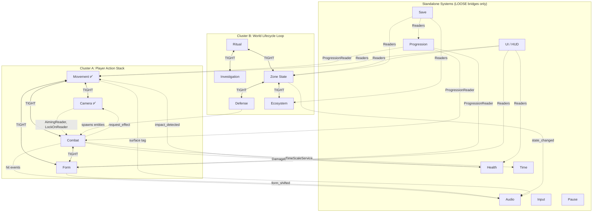

> [!NOTE]
> **Reference file** — consult when designing a new system or cluster. Daily work uses `CONSTITUTION.md` + `ARCHITECTURE-MAP.md`.

## Navigation

- [1. System Inventory](#1-system-inventory)
- [2. Coupling Matrix](#2-coupling-matrix-sparse--tight-loose-tbd-only)
- [3. Cluster Map](#3-cluster-map)
- [4. Tick Order Skeletons](#4-tick-order-skeletons)
- [5. Cross-Cluster Bridge Registry](#5-cross-cluster-bridge-registry)
- [6. Resource Allocation](#6-resource-allocation)
- [7. Recommended Stage 1 Batching](#7-recommended-stage-1-batching)
- [Deferred TODOs](#deferred-todos-captured-during-movementcamera-pre-session-1-reconciliation-pass)

---

# System Map — Druid: Shape-Shifter's Ritual

## 1. System Inventory

| # | System | Role | Status |
|---|--------|------|--------|
| 1 | Movement | Locomotion, stamina, collision — Brain/Broker/Motors/Services/Body stack shared by player and enemies | done (Stages 1–6) |
| 2 | Camera | Follow, aim, lock-on, occlusion, composable effects, visual interpolation — single-instance rig | partial (Stage 1) |
| 3 | Combat | Melee (Monkey counter), stealth (Panther takedowns), ranged (Avian archery), enemy AI behavior, hit detection, lock-on targeting | pending |
| 4 | Form | Instant shapeshifting between Panther/Monkey/Avian — collision shape swap, motor mask, moveset selection | pending |
| 5 | Progression | Use-to-improve — tracks skill usage, widens windows, modifies stat parameters over time | pending |
| 6 | Health & Damage | HP ownership, fall damage curve, hit damage application, defeat/death, invulnerability frames | pending |
| 7 | Ritual & Restoration | Music-timing minigame, cascade trigger, zone state mutation (Dead → Restoring) | pending |
| 8 | Investigation | Finding ritual objects scattered in the zone — environmental discovery that builds the ritual recipe | pending |
| 9 | Zone State | Dead → Restoring → Alive lifecycle per zone — drives visual/audio layering, gates Defense and Ecosystem phases | pending |
| 10 | Defense | Post-ritual wave survival — wave director, enemy spawning, wave-count gating | pending |
| 11 | Ecosystem Management | Post-defense resource placement (water/seeds/wind/fire) — biome health tracking toward self-sufficiency | pending |
| 12 | Audio | Stem layering, bus routing, stealth filtering (Panther), ritual music adaptation, zone-state-driven ambience | pending |
| 13 | UI / HUD | Minimal contextual HUD — stamina bar, form indicator, zone state — reads game state via Readers | pending |
| 14 | Input | Godot InputMap → semantic actions (Jump, Attack, Shapeshift, Interact) — consumed by Brain and CameraBrain | pending |
| 15 | Save / Persistence | JSON serialization of zone states, progression data, ecosystem placements | pending |
| 16 | Pause / Menu | Game-state freeze via process_mode, settings screen | pending |
| 17 | Time | Engine.time_scale management — hit-pause, slow-mo effects, freeze frames | pending |

---

## 2. Coupling Matrix (sparse — TIGHT, LOOSE, TBD only)

### TIGHT pairs

| System A | System B | Coupling | Reason | Contract / Seam |
|----------|----------|----------|--------|-----------------|
| Movement | Camera | TIGHT | Camera reads post-tick `Body` position; tick order determines frame lag; GameOrchestrator coordination required | `BodyReader`, `GameOrchestrator` tick order, `CameraReader` (PlayerBrain reads camera-forward for `aim_target`) |
| Movement | Combat | TIGHT | Enemies share the same Brain/Broker/Motors stack (shared entity composition); `Intents` struct carries combat fields (`wants_attack`, `wants_parry`, etc.) inside Movement's owned struct (Rule 10); `StaminaComponent` is drained by both Movement motors and Combat actions (shared mutable state) | `Intents` (shared struct — combat fields live inside), `StaminaComponent` (mutable access from both), `BodyReader`, shared Brain/Broker/Motors entity stack |
| Movement | Form | TIGHT | Form determines which Motors participate in arbitration and which collision shape is active per form. On shapeshift, Form emits `form_shifted(new_form)` upward; the parent `EntityController` catches it and calls `MovementBroker.set_allowed_motors(mask)`, `MovementBroker.inject_forced_proposal(FORCED)`, and the collision-shape swap downward (Rule 13 — sibling Form never invokes MovementBroker/Body directly). Coupling remains TIGHT because motor masks, collision shapes, and forced-interrupt timing must be co-designed with Movement — the signal/forward pattern does not weaken the design-time coupling | `form_shifted` (Form signal — PULSE); `Broker.set_allowed_motors()`, `Broker.inject_forced_proposal()`, collision shape swap on `CharacterBody3D` (all invoked by EntityController) |
| Combat | Form | TIGHT | Form selection determines available combat moveset (Panther=takedowns, Monkey=counters, Avian=archery); mid-combat shapeshift must transition combat state gracefully; form-specific damage values and counter windows | Form → Combat moveset binding, combat state transition on shapeshift |
| Ritual | Investigation | TIGHT | Investigation discovers ritual objects that compose the ritual recipe; the ritual minigame cannot run without investigation findings; shared data model of "what the zone needs" | Ritual recipe data struct (discovered objects → required elements) |
| Ritual | Zone State | TIGHT | Ritual success directly triggers zone state transition (Dead → Restoring); Ritual reads current zone state to gate availability; Cascade is the transition mechanism | `ZoneState.transition_to()`, `ZoneStateReader` |
| Zone State | Defense | TIGHT | Defense phase starts when zone enters Restoring state; Defense completion triggers zone → Alive; Zone State gates when Defense runs | `ZoneStateReader` (PULSE: `state_changed`), `ZoneState.transition_to()` |
| Zone State | Ecosystem | TIGHT | Ecosystem phase starts after Defense completes (zone reaches Alive-gated state); Ecosystem health feeds back into Zone State (biome self-sufficiency → zone fully Alive) | `ZoneState` read/write, biome health → zone state feedback |

### LOOSE pairs

| System A | System B | Coupling | Reason | Contract / Seam |
|----------|----------|----------|--------|-----------------|
| Camera | Combat | LOOSE | Camera reads aim state and lock-on target via Readers; Combat pushes screen shake via `request_effect()`. Remains LOOSE despite the transitive TIGHT chain (Camera↔Movement↔Combat) because: no shared data structs (Camera never touches `Intents` or `StaminaComponent`); no shared entity composition (Camera is a single-instance rig, not per-entity); Camera consumes only Reader stubs — `BodyReader`, `AimingReader`, `LockOnTargetReader` — never mutable owners (Rule 2) | `AimingReader` (BOTH), `LockOnTargetReader` (BOTH), `CameraRig.request_effect()` |
| Movement | Health | LOOSE | Health subscribes to `BodyReader.impact_detected` for fall damage curve; Health emits `defeated` / stagger-class signals upward to the parent `EntityController`, which forwards them downward to `MovementBroker.inject_forced_proposal(RAGDOLL/DEFEAT)` (Rule 13 — siblings never call sideways); Movement has no reference to Health | `BodyReader` (PULSE: `impact_detected`); Health upward signals → `EntityController` → `MovementBroker.inject_forced_proposal()` |
| Movement | Interaction | LOOSE | Interaction uses a separate `InteractionIntents` struct (player-only, explicitly NOT in shared `Intents`); reads `BodyReader` for proximity checks | `InteractionIntents` (separate struct), `BodyReader` (STATE) |
| Combat | Health | LOOSE | Combat applies damage to target's Health; Health emits `defeated` so Combat stops targeting; one-way data flow via damage struct or direct call | `DamageEvent` struct or `Health.apply_damage()` (TBD), `HealthReader` (PULSE: `defeated`) |
| Combat | Time | LOOSE | Hit-pause on significant impacts; Combat requests time-scale change, everything freezes naturally | `TimeScaleService` Autoload (direct call) |
| Combat | Audio | LOOSE | Impact sounds, form-specific combat audio (Panther muffled, Monkey weighty hits) | Combat emits hit events → Audio reacts (PULSE) |
| Combat | Camera | LOOSE | (see Camera ↔ Combat above) | |
| Form | Audio | LOOSE | Shapeshift particle burst audio; Panther mode → stealth bus filtering (muffled world audio) | `FormReader` (PULSE: `form_shifted`) → Audio adjusts bus routing |
| Form | Camera | NONE | Structurally enforced: Camera composition root never receives a Form reference | N/A — form-agnostic by design |
| Movement | Audio | LOOSE | Footstep sounds based on ground material from `GroundService` surface tag; velocity-based wind audio | `BodyReader` (STATE: `get_velocity`), ground material tag |
| Zone State | Audio | LOOSE | Zone state (Dead/Restoring/Alive) determines ambient audio layering — Dead=silent, Alive=full soundscape | `ZoneStateReader` (BOTH: getter + `state_changed` signal) |
| Defense | Combat | LOOSE | Defense spawns enemies that use the Combat system; Defense manages wave lifecycle, not combat mechanics | Enemy entity spawning; enemies independently use Brain/Broker/Motors/Combat stack |
| Progression | Combat | LOOSE | Progression tracks combat skill usage (parries → wider window); Combat reads current skill levels via Reader | `ProgressionReader` (STATE: `get_skill_level`), `skill_used` event (PULSE) |
| Progression | Form | LOOSE | Progression tracks form usage time; Form reads unlocked abilities via Reader | `ProgressionReader` (STATE), `form_shifted` event (PULSE) |
| Progression | Movement (Stamina) | LOOSE | Stamina cap is sourced from Progression; the specific integration pattern (pull via `ProgressionReader.get_stamina_cap()` during `tick_regen`, or push via `EntityController` listening for a `progression_changed` signal and calling `StaminaComponent.set_max_stamina()`) is **finalized in Session 3 (Progression Stage 1)**. The coupling verdict (LOOSE via Reader *or* signal bridge) is settled; call-direction is not. Sprint speed is a project-wide constant (no Progression interaction, no scaling over time). | `ProgressionReader.get_stamina_cap()` **or** `progression_changed` (STATE/PULSE — decided Session 3) |
| Health | Camera | NONE | Screen shake is triggered by Combat hits, not by health changes; Camera ↔ Health has no direct path | N/A |
| UI | Movement | LOOSE | UI reads `StaminaReader` for stamina bar display | `StaminaReader` (BOTH) |
| UI | Health | LOOSE | UI reads `HealthReader` for HP display | `HealthReader` (BOTH) |
| UI | Form | LOOSE | UI reads `FormReader` for form indicator display | `FormReader` (BOTH) |
| UI | Zone State | LOOSE | UI reads `ZoneStateReader` for zone state indicator | `ZoneStateReader` (BOTH) |
| UI | Progression | LOOSE | UI reads `ProgressionReader` for skill level display | `ProgressionReader` (STATE) |
| Save | Zone State | LOOSE | Save serializes zone state data (async filesystem I/O) | `ZoneStateReader` (STATE), async I/O |
| Save | Progression | LOOSE | Save serializes skill/progression data | `ProgressionReader` (STATE), async I/O |
| Save | Ecosystem | LOOSE | Save serializes placed resources and biome health | `EcosystemReader` (STATE), async I/O |
| Input | Movement | LOOSE | `PlayerBrain` reads Godot `Input` singleton to produce `Intents` | Godot `Input` singleton (engine-provided) |
| Input | Camera | LOOSE | `CameraBrain` reads Godot `Input` singleton to produce `CameraInput` | Godot `Input` singleton (engine-provided) |
| Pause | All gameplay | LOOSE | Sets `process_mode` on game nodes to freeze; resumes on unpause | Godot `process_mode` (engine-provided) |

### TBD pairs (design decision pending)

| System A | System B | Question | Recommendation |
|----------|----------|----------|----------------|
| Ritual | Input | Does the rhythm minigame poll Godot's `Input` singleton inside `_physics_process` (17ms resolution, routed via `Brain → Intents` like movement/combat), or does it subscribe to raw `InputEvent` with OS timestamps (sub-frame precision, bypasses the intent pipeline)? | Decide during Ritual Stage 1. With ±100ms tolerance windows, physics-tick polling is within budget; but rhythm input is neither a locomotion nor a combat intent, and routing it through `Brain → Intents` may be semantic pollution of a shared struct that exists for per-entity action arbitration. Lean toward raw `InputEvent` subscription inside the Ritual system's own input adapter. |

---

## 3. Cluster Map



### Cluster summaries

**Cluster A — Player Action Stack (Movement, Camera, Combat, Form):**
The real-time gameplay core. All four systems participate in the physics tick loop, share the `Intents` struct, share the Brain/Broker/Motors entity stack, and have mutual tick-order dependencies. Designing any one without the other three causes retro-edits. Movement and Camera Stage 1 are already done; Combat and Form Stage 1 must be co-authored in the same session, referencing the existing Movement/Camera artifacts.

**Cluster B — World Lifecycle Loop (Investigation, Ritual, Zone State, Defense, Ecosystem):**
The zone progression pipeline. Driven by player actions and events, not by physics-tick ordering. Zone State is the hub — every other member reads or writes zone state. The flow is linear: Investigation → Ritual → Zone State → Defense → Ecosystem → Zone State. These five should be co-authored in the same Stage 1 session.

**Standalone Systems (Progression, Health, Audio, UI, Input, Save, Pause, Time):**
Each connects to one or both clusters via LOOSE bridges only. They can be designed independently as long as the bridge contracts are reserved upfront. Some (Input, Pause) may not need full architecture stages — they're thin wrappers around engine features.

---

## 4. Tick Order Skeletons

### Cluster A — Player Action Stack

Current established order (from Movement-05 + Camera-01):

```
GameOrchestrator._physics_process(delta):
  1. PlayerBrain.gather_intents()           [Movement — populates move + combat intents + aim_target]
  2. CameraBrain.gather_camera_input()      [Camera — populates look_delta, wants_lock_on, wants_aim]
  3. MovementBroker.tick(intents, delta)     [Movement — arbitration + active Motor + Body.apply_motion]
  4. CameraBroker.tick(camera_input, delta)  [Camera — reads post-motion BodyReader, computes view]
```

Proposed skeleton with Combat and Form inserted (TBD — confirmed during Stage 1):

```
GameOrchestrator._physics_process(delta):
  1. Brain.gather_intents()                  [polymorphic — PlayerBrain AND every enemy AIBrain run
                                              here (Rule 10). Each populates the FULL Intents struct:
                                              movement fields (move_dir, wants_jump, ...) AND combat
                                              fields (wants_attack, wants_parry, ...). AIBrain reads
                                              last-frame combat state via Readers to decide intents.]
  2. CameraBrain.gather_camera_input()      [Camera — player-only camera input]
  3. FormBroker.tick(intents, delta)         [Form — TBD: resolve shapeshift, update motor mask,
                                              swap collision shape BEFORE Movement arbitrates]
  4. MovementBroker.tick(intents, delta)     [Movement — drains queued FORCED proposals enqueued
                                              LAST frame by inject_forced_proposal(), arbitrates
                                              with the correct form's motor mask, dispatches the
                                              winning Motor, applies motion to Body.]
  5. CombatBroker.tick(intents, delta)       [Combat — HIT RESOLUTION only, NOT intent gathering.
                                              Intents were already gathered in step 1. Here: reads
                                              post-motion BodyReader, applies damage to targets'
                                              Health, updates lock-on targeting, emits upward signals
                                              (stagger_triggered, hit_landed, ...). Any FORCED
                                              proposal enqueued by the EntityController in response
                                              to those signals takes effect NEXT frame — this is
                                              the documented 1-frame latency budget for cross-system
                                              locomotion interrupts.]
  6. CameraBroker.tick(camera_input, delta)  [Camera — always last; reads final Body + Combat state]
```

**Rationale for TBD slots:**
- **Form before Movement:** Shapeshift changes the motor mask and collision shape. If Form ticks after Movement, Movement arbitrates with the old form's motors for one frame (wrong). Form must resolve first.
- **Combat after Movement:** Hit detection needs post-motion positions. If Combat ticks before Movement, ray casts use stale positions (off by one frame of motion).
- **Camera always last:** Camera is presentation. It must observe the final state of all gameplay systems on this frame.

### Cluster B — World Lifecycle Loop

**No deterministic tick ordering required.** These systems are event-driven:
- Investigation: continuous (player finds objects during exploration via Interaction system)
- Ritual: triggered by player interaction → runs music-timing minigame (its own internal loop)
- Zone State: transitions on events (ritual complete, defense complete, ecosystem self-sufficient)
- Defense: starts on zone state change → manages wave lifecycle (spawns enemies, counts waves)
- Ecosystem: starts after defense complete → manages resource placement (player-driven)

These systems react to signals from Zone State and player actions. They do not need slots in `GameOrchestrator._physics_process`. If any Cluster B system later requires per-frame updates (e.g., Defense wave timer), it registers with `GameOrchestrator` at that time — but this is a Stage 4 decision, not a Stage 0 mandate.

### Standalone Systems

- **Progression:** Event-driven. Listens to `skill_used` signals from Combat/Movement. No tick slot needed.
- **Health:** Event-driven. Receives `apply_damage()` calls from Combat; subscribes to `impact_detected` from Movement for fall damage. No tick slot needed.
- **Audio:** Runs in `_process` (render-rate) for smooth audio transitions. Not part of `GameOrchestrator._physics_process`.
- **UI:** Runs in `_process` (render-rate) for responsive UI updates. Not part of physics tick.
- **Time:** Stateless utility Autoload. Called on-demand by Combat. No tick.
- **Input:** Engine-provided (`Input` singleton). No tick.
- **Save:** Async I/O. Triggered by player action or auto-save timer. No tick.
- **Pause:** Engine-provided (`process_mode`). No tick.

---

## 5. Cross-Cluster Bridge Registry

| Contract | Owner | Consumer(s) | Type | Notes |
|----------|-------|-------------|------|-------|
| `BodyReader` | Movement | Camera, Combat, Health, Interaction, UI, AI perception | BOTH | Declared in Movement-06. Getters: `get_global_position`, `get_velocity`, `is_on_floor`. Signals: `grounded_changed`, `impact_detected`. |
| `StaminaReader` | Movement | UI, AI perception | BOTH | Declared in Movement-06. Getters: `get_value`, `get_max`, `is_exhausted`. Signals: `exhausted`, `stamina_changed`. |
| `LocomotionStateReader` | Movement | Camera, Combat, UI, AI perception | BOTH | Declared in Movement-06. Getter: `get_active_mode`. Signal: `state_changed`. |
| `CameraReader` | Camera | PlayerBrain (for `aim_target`), future Audio, future VFX | BOTH | Declared in Camera-01. Getters: `get_global_position`, `get_forward`, `get_fov_degrees`. Signals: `aim_state_changed`, `target_rebound`. |
| `CameraRig.request_effect()` | Camera | Combat (shake), Health (TBD) | PULSE | Declared in Camera-01. Accepts `EffectRequest` struct. Single choke point for cross-system camera effects. |
| `CameraRig.set_target()` | Camera | MountManager / PlayerController (mount-swap) | PULSE | Declared in Camera-01. Accepts `BodyReader`. Rebinds camera follow target. |
| `AimingReader` | Combat (future) | Camera | BOTH | Declared in Camera-01. Getter: `is_aiming`. Signal: `aim_state_changed`. MVP stub in `CombatContextStub` returns `false`. |
| `LockOnTargetReader` | Combat (future) | Camera | BOTH | Declared in Camera-01. Getter: `get_target`, `has_target`. Signal: `target_changed`. MVP stub in `CombatContextStub` returns `null`. |
| `Intents` | Movement (struct owner) | Movement, Combat (shared struct — both populate fields) | STATE | Declared in Movement-06. Combat fields (`wants_attack`, etc.) populated by Brain. Not consumed by Camera. |
| `TransitionProposal` | Movement (struct owner) | Movement, Camera (reused for mode arbitration) | STATE | Declared in Movement-06. Reusable priority-based proposal struct. |
| `MovementBroker.inject_forced_proposal()` | Movement | `EntityController` (parent-only) | PULSE | Declared in Movement-06. Single choke point for cross-system locomotion interrupts. **Per Rule 13, siblings never call this directly.** Combat / Health / Interaction / Form emit upward signals (e.g., `stagger_triggered`, `defeated`, `cinematic_requested`, `form_shifted`); the parent `EntityController` catches them and calls `inject_forced_proposal()` downward with a FORCED `TransitionProposal`. Runtime-asserted FORCED-only. Queued until the next `MovementBroker.tick()` — documented 1-frame latency budget. |
| Cross-system forced-interrupt signals | Combat / Health / Interaction / Form (per-system owners) | `EntityController` | PULSE | Umbrella entry — each system declares its own signal names in its Stage 1/6 artifact (Combat: `stagger_triggered`, `hit_landed`; Health: `defeated`, `hp_zeroed`; Interaction: `cinematic_requested`; Form: `form_shifted`). These are the upward half of the forced-interrupt bridge; `EntityController` is the sole subscriber and forwards to `MovementBroker.inject_forced_proposal()`. |
| `HealthReader` | Health | Combat, UI, AI perception | BOTH | TBD — not yet declared. Getters: `get_current`, `get_max`. Signals: `health_changed`, `defeated`. |
| `DamageEvent` | Combat (producer) | Health (consumer) | PULSE | TBD — struct or direct call. Combat creates, Health receives. One-way. |
| `FormReader` | Form | Audio, UI, Progression, Combat | BOTH | TBD — not yet declared. Getter: `get_active_form`. Signal: `form_shifted`. |
| `ProgressionReader` | Progression | Combat, Movement (Stamina only), Form, UI | STATE | TBD — not yet declared. Getters: `get_skill_level(skill_id)`, `get_stamina_cap()`. Movement consumes the stamina cap either via `StaminaComponent.tick_regen` reading `get_stamina_cap()` each tick (pull), or via `EntityController` listening for a `progression_changed` signal and calling `StaminaComponent.set_max_stamina()` (push) — **the pull-vs-push decision is finalized in Session 3 (Progression Stage 1)**. Pre-Session-3, Movement-06's `StaminaComponent` keeps `max_stamina` as an `@export` default (no typed `ProgressionReader` field yet, since `class_name ProgressionReader` is not declared until Progression Stage 1). Sprint speed and other locomotion stats are project-wide constants and do NOT scale with Progression. |
| `ZoneStateReader` | Zone State | Audio, UI, Save, Defense, Ecosystem | BOTH | TBD — not yet declared. Getter: `get_state(zone_id)`. Signal: `state_changed(zone_id, old, new)`. |
| `EcosystemReader` | Ecosystem | Save, Zone State | STATE | TBD — not yet declared. Getter: `get_biome_health`, `get_placed_resources`. |
| `TimeScaleService` | Time | Combat | PULSE | TBD — Autoload utility. `set_time_scale(scale, duration)`. Stateless — sets `Engine.time_scale`, auto-restores. |
| `SaveManager` | Save | PlayerController (trigger), Zone State, Progression, Ecosystem (data sources) | STATE + **ASYNC** | TBD — Autoload utility. Reads via Readers, writes to filesystem. Genuinely async (filesystem I/O). |
| `InteractionIntents` | Interaction (struct owner) | Interaction system only (player-only) | STATE | Reserved in Movement-01 (explicitly NOT in shared `Intents`). |

---

## 6. Resource Allocation

### F-Key Debug Overlay Registry

| Key | System | Status |
|-----|--------|--------|
| F1 | Movement | Allocated (Movement-01) |
| F2 | Camera | Allocated (Camera-01) |
| F3 | Combat | Projected — hit detection state, damage events, active moveset, lock-on target, AI behavior |
| F4 | Form | Projected — active form, collision state, shapeshift history, motor mask |
| F5 | Progression | Projected — skill levels, usage counters, active stat mods |
| F6 | Zone State | Projected — per-zone state (Dead/Restoring/Alive), transition history, active zone |
| F7 | Ritual | Projected — timing windows, cascade progress, discovered objects |
| F8 | Defense | Projected — wave number, enemy count, spawn events, wave timer |
| F9 | Ecosystem | Projected — biome health, placed resources, self-sufficiency progress |
| F10 | Health | Projected — HP, damage log, invulnerability frames, fall damage events |
| F11 | Audio | Projected — active bus routing, stem layers, current mix state (if runtime debugging needed) |
| N/A | Investigation | No separate panel — sub-view of Ritual (F7) or Interaction system |
| N/A | Input | No panel — input is visible through Brain intents in Movement (F1) |
| N/A | Save | No panel — async I/O, no real-time gameplay state to debug |
| N/A | Pause | No panel — trivial on/off state |
| N/A | Time | No panel — time scale visible in DebugOverlay frame timing |
| N/A | UI | No panel — debugging UI through UI is circular |

### Autoload Registry

| Name | Owner | Responsibility |
|------|-------|----------------|
| `GameOrchestrator` | Cross-system (declared by Movement-05) | Deterministic per-frame tick order for all physics-locked systems. `PROCESS_MODE_ALWAYS`. |
| `DebugOverlay` | Cross-system (declared by Movement-05) | Debug panel host. `PROCESS_MODE_ALWAYS`. Debug builds only. Holds one context node per system. |
| `TimeScaleService` | Time | Stateless utility. `set_time_scale(scale, duration)` → sets `Engine.time_scale`, auto-restores after duration. No game state (Rule 14). |
| `SaveManager` | Save | Stateless I/O utility. `save_game()` / `load_game()`. Reads game state via Readers, serializes to JSON, writes to `user://`. No game state held (Rule 14). |
| `AudioManager` | Audio | Bus routing utility. Manages AudioBus configuration, stem layering, stealth filtering. No game state — responds to signals from `FormReader`, `ZoneStateReader`. |

**Not Autoloads (game state lives in scene tree per Rule 14):**
- Zone state data → lives in scene-tree nodes per zone, not in an Autoload.
- Progression data → lives in a scene-tree `ProgressionTracker` node under the player entity.
- Health data → lives in a scene-tree `HealthComponent` node per entity.
- Ecosystem data → lives in scene-tree nodes per zone.

---

## 7. Recommended Stage 1 Batching

**Batching = same session/conversation for cross-system coherence. Each system still produces its own individual `01-scope-and-boundaries-[system].md` artifact.** Never a joint artifact.

### Session 1: Player Action Stack — Combat + Form

**Systems:** Combat, Form (Shapeshifting)
**Depends on:** Movement (done), Camera (done) — these are read-only references for this session.
**Why together:** Combat and Form are TIGHT with each other and both TIGHT with Movement. Form determines combat moveset; shapeshift mid-combat requires coordinated state transitions. Both insert TBD tick slots into the existing `GameOrchestrator` skeleton.

**Deliverables:**
- `docs/architecture/01-scope-and-boundaries-combat.md`
- `docs/architecture/01-scope-and-boundaries-form.md`
- Reconciliation edits to Movement and Camera artifacts if new seams emerge (expected: Movement-04/05 for tick order, Movement-06 for any new shared struct fields).

**Pre-reads:**
- All Movement artifacts (01–06)
- Camera-01
- This system map (00)

### Session 2: World Lifecycle Loop

**Systems:** Investigation, Ritual & Restoration, Zone State, Defense, Ecosystem Management
**Depends on:** Session 1 (Combat + Form must be scoped first — Defense spawns entities that use Combat; Zone State drives audio/visual layering that Form also touches).
**Why together:** All five are TIGHT through Zone State as the hub. The Investigation → Ritual → Zone State → Defense → Ecosystem pipeline is a single linear flow where each system's exit condition is the next system's entry condition.

**Deliverables:**
- `docs/architecture/01-scope-and-boundaries-investigation.md`
- `docs/architecture/01-scope-and-boundaries-ritual.md`
- `docs/architecture/01-scope-and-boundaries-zonestate.md`
- `docs/architecture/01-scope-and-boundaries-defense.md`
- `docs/architecture/01-scope-and-boundaries-ecosystem.md`

**Pre-reads:**
- Movement-01 (shared entity stack — enemies use it)
- Combat-01 (Defense spawns enemies with Combat behaviors)
- This system map (00)

### Session 3: Standalone Systems (can be parallelized)

**Systems:** Progression, Health & Damage, Audio, Time
**Depends on:** Sessions 1–2 (the bridge contracts these systems consume must be scoped first).
**Why together or parallel:** These systems have no TIGHT pairs. They can each be authored independently in separate sessions, or batched into one session for efficiency. They all consume bridges (Readers, events) from Cluster A and B systems that are now scoped.

**Deliverables:**
- `docs/architecture/01-scope-and-boundaries-progression.md`
- `docs/architecture/01-scope-and-boundaries-health.md`
- `docs/architecture/01-scope-and-boundaries-audio.md`
- `docs/architecture/01-scope-and-boundaries-time.md`

### Session 4: Infrastructure Systems (optional — may not need full architecture stages)

**Systems:** UI / HUD, Input, Save / Persistence, Pause / Menu
**Depends on:** Sessions 1–3 (these systems read from everything else).
**Why last:** UI, Input, Save, and Pause are consumer-only systems. They read game state via Readers but never produce game state. Their architectures are thin and determined entirely by what Readers exist. They should be scoped last, once all producer systems have declared their Reader surfaces.

**Assessment before running:**
- **Input** — may not need a Stage 1 artifact. It's Godot's `InputMap` + `Input` singleton. Brain consumes it. If the project uses only Godot's built-in input mapping, this is infrastructure, not architecture.
- **Pause** — may not need a Stage 1 artifact. It's Godot's `process_mode`. If no custom pause logic exists beyond freezing nodes, this is infrastructure.
- **UI** — likely needs a Stage 1 artifact to scope HUD elements, form indicator, zone state display, and establish which Readers it consumes.
- **Save** — likely needs a Stage 1 artifact to scope what's serialized, save format, and the async I/O pattern.

**Deliverables (as needed):**
- `docs/architecture/01-scope-and-boundaries-ui.md`
- `docs/architecture/01-scope-and-boundaries-save.md`
- (Input and Pause: assess need before authoring)

---

## Summary: Session Dependency Graph

```
Session 1 (Combat + Form)
    ↓
Session 2 (World Lifecycle: Investigation, Ritual, Zone State, Defense, Ecosystem)
    ↓
Session 3 (Standalone: Progression, Health, Audio, Time)  ← can run parallel with Session 2
    ↓
Session 4 (Infrastructure: UI, Save, and assess Input/Pause)
```

Sessions 2 and 3 can run in parallel if Session 1 is complete — they don't depend on each other, only on Session 1's outputs.

---

## Deferred TODOs (captured during Movement/Camera pre-Session-1 reconciliation pass)

Items flagged during the system-map alignment pass but deliberately deferred to an upcoming Session or later stage. Each TODO names the Session/stage that closes it so none slip.

| # | TODO                                                                                       | Origin artifact                                    | Closes in                                        |
|---|--------------------------------------------------------------------------------------------|----------------------------------------------------|--------------------------------------------------|
| 2 | Mount-swap caller: who swaps the active entity on mount — `MountManager` vs `EntityController` routed call | `rationale/01-scope-and-boundaries-player-action-stack.md` (Cross-System Seams: Movement ↔ Camera) | Whichever is scoped first: MountService (future Movement revision) or a future cluster stage |
| 3 | `min_impact_velocity` ownership boundary (Camera's landing-shake threshold — tuning value vs future Health's fall-damage threshold) | `rationale/01-scope-and-boundaries-player-action-stack.md` (Cross-System Seams: Movement ↔ Camera) | Cluster Stage 4 / Stage 6 (future cluster session) |
| 5 | `EntityController` naming consistency across three edge-case examples in cluster Stage 3    | `rationale/03-edge-cases-player-action-stack.md`             | Architecture audit (Stage 07) pass               |
| 7 | Runtime assertion that `inject_forced_proposal` caller is `EntityController`               | `rationale/06-interfaces-and-contracts-player-action-stack.md` | Implementation (graybox phase, not Stage 1)      |
| 8 | Stamina cap pull-vs-push integration pattern (replace TBD note with concrete `ProgressionReader` wiring) | `rationale/06-interfaces-and-contracts-player-action-stack.md` + this map | Session 3 (Progression Stage 1)                  |

**Closed by `rationale/01-scope-and-boundaries-player-action-stack.md` (Cluster A Stage 1):**
- *Row 1 — Form-agnostic structural enforcement* closed by Cross-System Seams: Camera ↔ Form (coupling = NONE, composition root has no field to receive a Form reference).
- *Row 4 — EntityController role clarity* closed by Entity Composition section (owns StaminaComponent; wires three Brokers; forwards all upward signals to downward calls; implements no gameplay logic).
- *Row 6 — Intents combat-field population in MVP* closed by Shared Contracts → `Intents` (AIBrain populates combat fields day one; Movement ignores them pre-Combat; no struct revision needed when Combat ships). Final MVP field list also locked in that section.

Rows 2, 3, 5, 7 are hygiene or deferred-detail items closed in later cluster stages or at implementation time. Row 8 is the only structural TBD that blocks a final contract-file edit; it is handled by the existing StaminaComponent TBD note in Movement-06 and the softened Progression ↔ Movement (Stamina) coupling row above.
