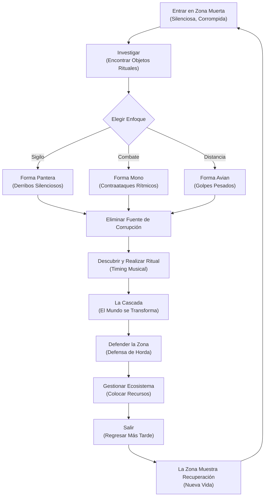
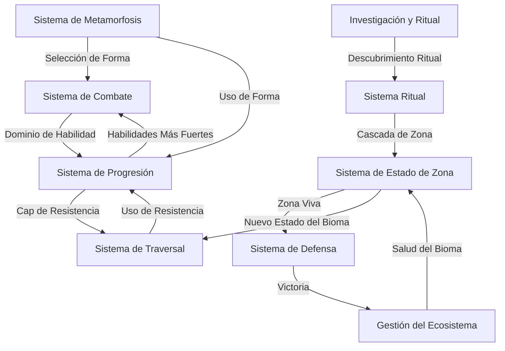
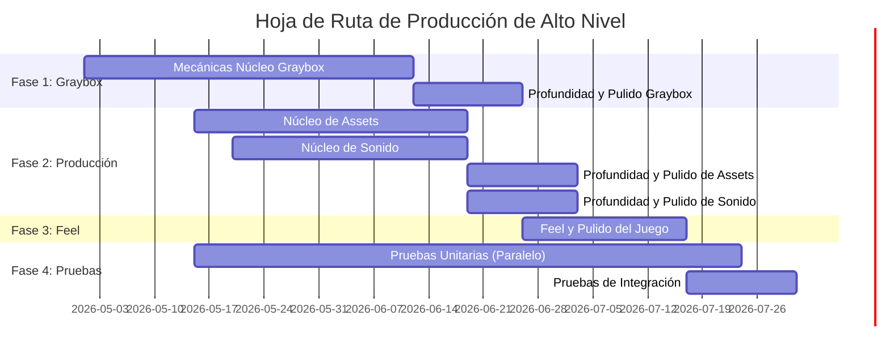

# Druid: Shape-Shifter's Ritual

## 1. El Gancho y la Visión

Un mundo que se está muriendo comienza a despertar, pero algo está mal.

La tierra está en silencio. El cielo cuelga gris. Donde debería haber trinos de pájaros y viento, sólo existe el zumbido tenue de una podredumbre morada y reptante—una corrupción sobrenatural que se extiende por los biomas como un parásito. Eres un druida, un metamorfo de magia ancestral. Has aprendido los caminos antiguos: convertirte en el depredador, el guardián, el arquero. Invocar la lluvia y comandar los elementos. Sanar.

Tu misión es adentrarte en estas zonas corrompidas, una por una, y realizar los rituales que las restaurarán. Pero cada ritual es un descubrimiento, no un guión—debes investigar qué causó la corrupción, reunir los objetos rituales y eliminar la fuente. Entonces llega el momento de la transformación: cae la lluvia, se levanta el viento, la vida irrumpe. Los colores regresan. El mundo vuelve a respirar.

Pero la restauración no es el final—es sólo el comienzo de la responsabilidad. A medida que cada zona despierta, debes defenderla de un contraataque de corrupción y luego gastar tu poder elemental para moldear el ecosistema renacido hacia el equilibrio. Cuando hayas hecho suficiente, te vas. Y cuando regreses, la tierra recordará lo que hiciste—nueva vida habrá echado raíces. Pero emergen preguntas más oscuras: ¿por qué algunas zonas muestran signos de re-corrupción? ¿Cuál es la verdadera fuente de esta plaga morada?

Este es un juego sobre la transformación—personal, ecológica, a escala mundial. Cada mecánica (sigilo, combate, magia, gestión de recursos) fluye de un solo principio: **usas el mismo conjunto de herramientas para luchar, sanar y construir**. No hay misiones secundarias; la restauración *es* la misión.

---

### Tablero de Referencias Visuales

## 2. Análisis de Referencias

### Juegos de Referencia

Estudiamos estos juegos porque cada uno sobresale en un pilar fundamental que estamos construyendo:

- **The Legend of Zelda: Breath of the Wild** — Por qué: Respuesta inmediata a los controles, traversal físico (escalar, nadar, planear, aterrizar con impacto), la resistencia como esfuerzo, y el estado del mundo comunicado visualmente y por audio, no por texto en pantalla.

- **Assassin's Creed** — Por qué: Movimiento sigiloso fluido, cubrirse magnéticamente y el estado de flujo depredador de la infiltración.

- **Shadow of War** — Por qué: Apuntado magnético, ritmo de control de masas, ventanas de contraataque legibles y el hitpause que celebra el timing del jugador.

- **The Legend of Zelda: Skyward Sword / Skyrim** — Por qué: Mecánicas de arco con tensión (disparo cargado), progresión por uso (las habilidades evolucionan con la práctica, no acumulando XP).

- **Shadow of the Colossus** — Por qué: Proporciones realistas y escala pies en tierra; sentirse pequeño frente a encuentros masivos.
- **Terra Nil** — Por qué: La gestión del ecosistema como bucle central—empujar los biomas hacia la autosuficiencia, verlos florecer, regresar y encontrar evidencia biológica de sanación.

### La Lista de "Conservar" (Lo que estamos emulando)

- **Respuesta instantánea con momentum suave** — el movimiento del jugador se siente inmediato, como si el mundo estuviera escuchando (BotW).
- **La resistencia limita la exploración** — el esfuerzo es visible y medible; escalar cuesta resistencia, nadar cuesta resistencia, correr cuesta resistencia. El mundo resiste, pero en última instancia es explorable (BotW).
- **Sigilo y derribo magnéticos** — el sigilo es un estado de flujo, no un puzle; movimiento fluido de cobertura en cobertura (AC).
- **Combate rítmico con ventanas de contraataque legibles** — el combate consiste en leer el ritmo y golpear en el momento exacto (SoW).
- **Progresión basada en forma, no en armas** — la identidad del jugador cambia (Pantera, Mono, Avian); la forma cambia cómo afrontas un desafío.
- **Mejora por uso** — lanza una bola de fuego 50 veces y se vuelve más fuerte; para 100 veces y tu ventana de timing se amplía (Skyrim).
- **UI mínima y contextual** — la pantalla permanece limpia; el mundo cuenta la historia (BotW).
- **Gestión del ecosistema como bucle central** — después de restaurar una zona, la moldeas; al regresar encuentras que la vida ha echado raíces (Terra Nil).

### La Lista de "Descartar" (Lo que estamos evitando)

- **Árboles de diálogo de NPCs y marcadores de misiones** — sin registro de misiones; la investigación y el descubrimiento están integrados en la exploración (a diferencia de las convenciones modernas de mundo abierto).
- **Armas genéricas e inventario inflado** — las formas y la magia reemplazan completamente a las armas; nada de "recoger 47 variantes de espada."
- **Complejidad artesanal** — los objetos rituales se *encuentran*, no se fabrican; la progresión trata sobre el uso y el descubrimiento, no sobre acumular materiales.
- **Escala continental** — construimos zona por zona, no salvamos un planeta de una sola vez. El alcance es íntimo y navegable.
- **Historia pesada / cinemáticas largas** — la narración ambiental y el comportamiento de los NPCs llevan la narrativa; la tierra habla por sí misma.
- **Gacha, servicio en vivo, mecánicas de pase de batalla** — experiencia para un solo jugador, autónoma.

---

## 3. Identidad Central

### Resumen de Concepto

Una aventura de acción en tercera persona donde un druida metamorfo aprende a sanar un mundo moribundo—usando magia elemental, sigilo fluido y combate rítmico contra una corrupción sobrenatural morada—gestionando después el ecosistema renacido mientras despierta.

### Género y Formato

- **Género:** Aventura de Acción con Exploración y Gestión de Ecosistemas
- **Formato:** 3D, un jugador, con posibilidad de co-op opcional (arquitectura de servidor escucha para el futuro)
- **Público Objetivo:** Jugadores que valoran la jugabilidad responsiva momento a momento (BotW, AC), el timing rítmico (mecánicas de parada/contraataque) y la narrativa emergente (diseño ambiental sobre cinemáticas)

### Pilares Fundamentales

1. **El Estado del Mundo es Visual y Sonoro (No UI).** El jugador lee la salud de la zona, la propagación de la corrupción y la recuperación del ecosistema a partir de lo que ve y escucha—gradientes de color, densidad de partículas, capas de ambiente. El HUD es mínimo y contextual.

2. **Movimiento y Combate Responsivos y Físicos (BotW).** Cada entrada se siente inmediata. Escalar tiene cadencia. Aterrizar tiene impacto. El combate se lee como un ritmo—las ventanas de contraataque son ajustadas, el feedback es nítido y el jugador siente su habilidad de timing.

3. **Un Kit de Herramientas Unificado.** Las formas y la magia elemental se usan tanto para el combate *como* para la restauración. La Pantera se infiltra sigilosa y elimina la corrupción. El Mono aplasta enemigos y despeja escombros de piedra. El Avian alcanza salientes elevadas y ataca fuentes de corrupción distantes. No hay "poderes secundarios"—cada herramienta tiene un propósito.

4. **Transformación de Muerto a Vivo.** El pico emocional del juego es el momento del ritual y la cascada que le sigue. Un bioma gris y silencioso se convierte en vibrante, vivo y único. Esta permanencia importa: regresar a una zona restaurada muestra la recuperación biológica, y la zona se *siente* diferente en el juego.

---

### Narrativa y Base de Lore

**La Premisa:** Una corrupción sobrenatural morada se ha ido extendiendo por el mundo, drenando la vida y convirtiendo los biomas en yermos silenciosos. La causa es desconocida; sólo el síntoma es visible—venas moradas que se extienden desde fuentes de corrupción profundas y activas.

Eres un druida, heredero de una magia ancestral. Conoces las formas metamórficas y los rituales elementales. Tu papel no es "salvar el mundo" en un momento climático, sino adentrarte en cada zona corrompida y *restaurarla*. Una zona a la vez. Un ritual a la vez.

**El Arco Emocional:**
- **Pre-ritual:** Exploración sólida e infiltración en un mundo muerto y espeluznante. Estás investigando y acumulando poder.
- **El Momento Ritual:** Una ceremonia impulsada por la música donde invocas la lluvia, convocas la tierra o comandas el viento. El momento es ceremonial, tenso y climático.
- **La Cascada:** La vida irrumpe. Los colores florecen. La zona renace. Sientes el peso de lo que has hecho.
- **Post-Ritual:** La zona despierta, vulnerable y recién nacida. La defiendes de la re-corrupción y orientas el ecosistema hacia el equilibrio. Esto es trabajo, no heroísmo.
- **El Misterio:** A medida que restauras zonas, emergen patrones. Algunas muestran señales de *re-corrupción* más tarde. ¿Por qué? ¿Cuál es la verdadera fuente? Esta pregunta impulsa hacia adelante la narrativa macro.

---

## 4. Jugabilidad y Experiencia

### Tablero de Referencias de Jugabilidad

---

### El Bucle Central de Juego

Cada zona sigue el mismo arco: **Entrar → Investigar → Infiltrarse/Luchar → Restaurar → Defender → Gestionar → Salir**.

Pero la belleza está en las *elecciones* que haces a lo largo del camino. Cuando ves una colmena de cultistas sobrenaturales, ¿te cueleas como Pantera, silencioso y depredador, eliminándolos uno por uno? ¿O avanzas como Mono, convocando la fuerza del viento retorcido, listo para contraatacar sus golpes telegrafados y sentir el *golpe* del hitpause en cada parada perfecta? La propia zona te dice qué es posible—su disposición, su densidad de corrupción, los tipos de enemigos a los que te enfrentas.

Una vez que hayas limpiado la fuente de corrupción, descubres el ritual. No un guión que te entregan, sino una receta que has desvelado: agua, tierra, viento o fuego. Realizas la ceremonia y la música se eleva. Tus ventanas de timing se ajustan. Llega el momento—y la cascada *se activa*. El agua fluye. El viento se levanta. La vida regresa en oleadas. La zona se transforma del silencio gris a un bioma vibrante y respirante.

Pero el ritual no es el final. Es el comienzo de una nueva fase: la defensa. La zona está despertando, vulnerable. La corrupción monta un contraataque, y tú la defiendes. Luego llega el trabajo tranquilo—la orientación del ecosistema. Tienes poder elemental para gastar: coloca fuentes de agua, siembra semillas, llama al viento para apartar escombros. Guía la zona hacia la autosuficiencia. Cuando ya no te necesite, te vas. Y cuando regreses—semanas después, en el juego—encuentras que nueva vida ha echado raíces. Los árboles han crecido. Los animales han regresado. El mundo recordó tu trabajo.

### Experiencia Momento a Momento

**La Sensación: Inmediata, Física, Responsiva**

Cada entrada aterriza al instante. Presionas saltar, saltas—sin retraso flotante, sin lag de entrada. El mundo escucha. Cuando escalas una pared de acantilado corrompido, sientes cada punto de apoyo costarle resistencia. Cuando aterrizas desde una gran altura, la cámara se hunde con el impacto; el mundo se estremece. Esta fisicalidad no es negociable. El movimiento es cómo el jugador lee el estado del juego—¿estoy cansado? ¿Puedo escalar esta próxima pared? ¿Tengo suficiente resistencia para correr hacia ese objetivo?

**Metamorfosis: El Momento Central**

Presionar el botón de Metamorfosis se siente como *convertirte*. Tu druida adopta una nueva forma—Pantera, Mono, Avian—con una ráfaga instantánea de partículas elementales. El cambio de forma es inmediato (un fotograma, sin retraso de animación) y tu velocidad se conserva. Ya estás corriendo como Pantera antes de que el cambio se complete. Esto mantiene la acción fluyendo; la metamorfosis no es una pausa, es una elección táctica tomada en movimiento.

**Forma Pantera: El Estado de Flujo Sigiloso**

Te agachas. Tu movimiento se vuelve silencioso, depredador. El mundo se amortigua—el audio ambiental baja, pero las señales de los enemigos se vuelven *más fuertes*, más nítidas. Puedes oír su respiración, sus pasos. El posicionamiento magnético te ancla a la cobertura; te deslizas entre repisas y paredes fluidamente (como Assassin's Creed). Cuando estás lo suficientemente cerca, tienes una ventana de derribo—una animación de eliminación silenciosa y fluida. El enemigo cae silenciosamente. La colmena nunca supo que estabas ahí. El tiempo como Pantera se siente como un atraco; siempre estás un paso adelante, siempre leyendo la situación.

**Forma Mono: El Choque Rítmico**

Te eriges. Tus puños brillan con poder elemental. Cuando los enemigos atacan, sus *señales* son legibles—un pequeño movimiento previo, un destello de color, una señal sonora. Tienes una ventana de contraataque (ajustada, pero aprendible). Presiona el botón en el momento correcto, y *hitpause*—el mundo se congela por un breve y satisfactorio instante. Luego explotas hacia adelante con un golpe pesado. El enemigo tambalea. Has convertido su impulso en tu contra. Repite. El ritmo es como un patrón de tambor. Fallas un contraataque y recibes daño—el timing importa.

**Forma Avian: La Precisión Tensa**

Tensas un arco (o convocas un golpe elemental a distancia). El tensado es pesado, deliberado—sientes la tensión acumularse. Tu cámara cambia a una perspectiva sobre el hombro, bloqueada en tu objetivo. El aire está quieto, enfocado. Cuando sueltas, la flecha/golpe sale disparado con *impacto*. Si lo has apuntado bien, la recompensa es satisfactoria. Si no, te has anunciado, y la colmena se lanza sobre ti. La forma Avian trata sobre el compromiso—eliges un disparo, lo tomas, y vives con las consecuencias.

**Traversal: La Resistencia como Narrativa**

La resistencia no es un número en una barra; es un mensaje. Estás corriendo hacia la solución de un puzle—tu respiración es pesada, tu movimiento se ralentiza a medida que el indicador se agota. Puedes escalar una estructura alta, pero a mitad de camino, tus brazos se cansan. ¿Descansas y caes, o empujas y te agarras a una saliente? Nadar se siente como ahogarse si tu resistencia está baja. Cada acción física tiene un coste, y ese coste se *siente* real. Así aprende el jugador las reglas del mundo: el esfuerzo es visible.

**El Momento Ritual: Clímax Musical**

Cuando realizas el ritual, el tiempo cambia. Comienza una canción pre-diseñada. Ves ventanas de timing mostradas—ritmos en un carril, ventanas para acertarlos. La música se eleva. La tensión aumenta. Aciertas las ventanas de timing y la música se hincha. El momento de liberación: un *florecimiento* distinto de poder irradia hacia afuera desde tu lugar ritual. Las partículas explotan. El audio se superpone rápidamente: agua → viento → hojas susurrantes → canto de pájaros lejano. La zona está *viva*. El jugador siente el peso de lo que ha hecho.

**Post-Ritual: Gestión Tranquila**

La cascada se desvanece. Ahora llega la fase de defensa—los enemigos se lanzan hacia la zona que está despertando. Tienes que aguantar. Pero no es interminable; es una *oleada*. Sobrevívela y pasas a la fase final: la orientación del ecosistema.

Aquí, el tiempo se ralentiza. Tienes poder elemental (acumulado durante el ritual o ganado a través del juego). Lo gastas: coloca una fuente de agua aquí, siembra semillas allá, convoca viento para apartar escombros. Estás *moldeando* el bioma. No hay combate; es estratégico y meditativo. Cuando la zona se siente equilibrada, lo sabes. El indicador bio sube. Has hecho suficiente. Puedes irte.

---

### Recorrido por una Zona (Una Sesión de Juego)

1. **Entras en la zona.** Está silenciosa. Gris. El único sonido es el zumbido tenue de la corrupción. Tus oídos se ajustan al vacío—la ausencia de canto de pájaros es en sí misma un mensaje.

2. **Investigas.** Lees la tierra. Hay un puente derrumbado aquí, una colmena de insectos allá, objetos rituales dispersos en lugares peligrosos. Encajas lo que ocurrió. Descubres la receta ritual (agua, tierra, viento o fuego—o una combinación).

3. **Te aproximas a la colmena.** Haces una pausa. ¿Pantera o Mono? La colmena está apretada, en terreno elevado, enemigos agrupados. Eliges Pantera. Pasas 20 minutos infiltrándote, silencioso y paciente. Eliminas a tres enemigos sin disparar una alarma. El cuarto te ve, y te comprometes—cambias a Mono y te enfrentas a la colmena restante en combate abierto. Intercambias golpes, lees contraataques, aciertas el timing. Hitpause. Victoria.

4. **Limpias la fuente de corrupción.** Es un jefe—una amalgama retorcida de materia sobrenatural. El combate es tenso, peligroso. Usas las tres formas: Pantera para escapar de su agarre, Mono para parar su embestida, Avian para romper su punto débil desde la distancia. Cuando cae, el aura morada retrocede ligeramente.

5. **Realizas el ritual.** Te sitúas en el espacio despejado. La música comienza. Aciertas las ventanas de timing. Tus dedos encuentran el ritmo. La música llega a su punto álgido. El florecimiento se activa. El agua fluye. El viento ruge. La vida regresa.

6. **La zona se defiende.** Una oleada de monstruos de corrupción surge para deshacer tu trabajo. Te interpones en su camino, luchando. Estás agotado, pero luchas. Cuando la oleada se rompe, sigues en pie.

7. **Gestionas el ecosistema.** Ahora todo está quieto de nuevo. Tienes 30 minutos (o el tiempo que elijas) para orientar la zona hacia el equilibrio. Una fuente de agua aquí. Semillas allá. Viento para limpiar ese barranco. Cada colocación se siente significativa.

8. **Te vas.** Estás satisfecho. La zona está viva. Sabes que sanará más, que la vida echará raíces. Volverás y encontrarás señales de recuperación.

9. **Regresas, semanas después.** Hay árboles ahora. Animales. El agua corre clara. La zona es *diferente*—no sólo restaurada, sino individualizada por las elecciones que hiciste. Y en la parte más profunda, notas algo: una tenue mancha morada en la tierra. La re-corrupción se está colando de nuevo. El misterio se profundiza.

---

### Sensación de Combate: Feedback por Forma

**Pantera:** Silenciosa. Pasos amortiguados. Audio de enemigos amplificado. Las animaciones de derribo son fluidas, sin sonido. Eres un fantasma.

**Mono:** Ruidoso. Impacto. El hitpause en los contraataques es *extremo*—una congelación notable que celebra tu timing. El golpe que sigue tiene peso. Satisfactorio.

**Avian:** Tensión. Feedback del tensado (audio y visual). El disparo tiene retroceso. El impacto es nítido y preciso.

---

---

## 5. Sistemas e Interacciones

### Tablero de Referencias de Sistemas

---

Toda la jugabilidad que hemos descrito fluye de ocho sistemas interconectados. Cada sistema es independiente pero alimenta a los demás, creando una jugabilidad emergente donde tus elecciones repercuten hacia afuera.

### Sistemas Centrales

#### El Sistema de Metamorfosis
**Qué es:** La habilidad del druida para cambiar instantáneamente entre tres formas—Pantera, Mono, Avian—cada una con conjuntos de movimientos, estilos de juego y sensaciones distintas.

**Cómo funciona:**
- Presionar el botón de Metamorfosis te transforma en una nueva forma en un solo fotograma
- Tu impulso se conserva (sin pausa, sin retraso de animación)
- Cada forma desbloquea acciones diferentes: Pantera obtiene derribos, Mono obtiene contraataques, Avian obtiene apuntado de tensar-y-soltar
- La ráfaga de partículas elementales al cambiar refuerza la *sensación* de transformación

**Elecciones del jugador:**
- ¿Qué forma uso en este encuentro? (Sigilo vs. combate directo vs. distancia)
- ¿Cuándo cambio en medio del combate para adaptarme a nuevas amenazas?
- ¿Cuánto tiempo dedico a dominar cada forma vs. repartir mi práctica?

#### El Sistema de Combate
**Qué es:** Cómo el jugador se enfrenta a los enemigos—diferente según la forma, con ritmos y feedback distintos.

**Pantera (Sigilo):**
- Derribos magnéticos: acércate suficientemente y tendrás una ventana de eliminación silenciosa
- Enfoque: infiltración y posicionamiento depredador
- Feedback: audio amortiguado, señales de enemigos amplificadas, animaciones silenciosas
- Riesgo/Recompensa: Alta recompensa por ejecución perfecta, pero ser descubierto = cambio a combate

**Mono (Cuerpo a Cuerpo):**
- Ritmo de contraataque: lee los telégrafos enemigos, acierta la ventana de contraataque
- Apuntado magnético: los enemigos se bloquean dentro del rango; no puedes fallar direccionalmente
- Feedback: Hitpause extremo en contraataques exitosos (celebración del timing), impactos con peso
- Riesgo/Recompensa: Alto techo de habilidad; las paradas perfectas se sienten increíbles, los fallos cuestan salud

**Avian (Distancia):**
- Tensar-y-soltar pesado: la tensión se acumula al cargar, el disparo tiene retroceso
- Encuadre de cámara sobre el hombro: enfoque, precisión, deliberación
- Feedback: Impacto nítido, contacto satisfactorio de flecha/golpe
- Riesgo/Recompensa: Te compromete con un disparo; revelar tu posición telegrafía tu ubicación

**Elecciones del jugador:**
- ¿El ritmo de qué forma coincide con mi estilo de juego?
- ¿Entablo combate o me retiro? ¿Está disponible el sigilo, o tengo que luchar?
- ¿Cómo leo los telégrafos enemigos y respondo en la estrecha ventana de contraataque?

#### El Sistema de Traversal y Movimiento
**Qué es:** Cómo el druida se mueve por el mundo—escalar, nadar, correr, planear.

**Sensación central:**
- Respuesta instantánea a las entradas (sin lag de entrada)
- Leve impulso en los cambios de dirección (no flotante, no brusco—sólido)
- La resistencia limita cada acción importante: escalar, nadar y correr tienen coste de resistencia
- Aterrizar tiene peso: la cámara baja en caídas altas, se reproduce audio de impacto

**La resistencia como narrativa:**
- La resistencia no es un número; es un mensaje. Poca resistencia = estás cansado, el movimiento se ralentiza, no puedes escalar
- ¿Escalas un acantilado alto? A mitad de camino, tus brazos se cansan. ¿Descansas y arriesgas caer, o empujas y te agarras?
- ¿Nadas con poca resistencia? Se siente como ahogarse. Cada segundo tiene un coste alto.

**Elecciones del jugador:**
- ¿Corro hacia el objetivo o conservo resistencia para escalar?
- ¿Puedo alcanzar esa saliente elevada antes de que se agote la resistencia, o busco otra ruta?
- ¿El movimiento de qué forma resuelve mejor este puzle de traversal? (Avian puede planear, Pantera puede hacer parkour, Mono puede escalar)

#### El Sistema de Progresión (Mejora por Uso)
**Qué es:** Las habilidades evolucionan con el uso, no acumulando XP ni comprando mejoras.

**Cómo funciona:**
- Lanza bolas de fuego repetidamente → los hechizos de fuego hacen más daño, desbloquean nuevas variantes
- Realiza paradas → tu ventana de contraataque se amplía, tu timing se vuelve más indulgente
- Usa una forma en combate → las habilidades de esa forma escalan, tu dominio se profundiza
- Sin árboles de habilidades, sin nivelado arbitrario; cada acción es práctica

**Feedback:**
- Los jugadores sienten la mejora inmediatamente: los números suben, las ventanas se abren, los tiempos de recarga se reducen
- Sin grinding; el dominio emerge naturalmente a través del juego

**Elecciones del jugador:**
- ¿Qué habilidades priorizo? (Inversión fuerte en una forma vs. equilibrio entre las tres)
- ¿Cómo aprovecho mi nivel de habilidad actual contra zonas más difíciles?
- ¿Me quedo seguro con mi Pantera de alto dominio, o me aventuro en Mono para manejar combate más duro?

**Curva de progresión:**
- Principio del juego: las habilidades mejoran rápidamente; cada parada amplía notablemente tu ventana
- Mitad del juego: las mejoras se ralentizan; el dominio trata sobre la consistencia, no las ganancias brutas de números
- Final del juego: las habilidades llegan a su techo; las ganancias posteriores son marginales; el dominio del jugador es el limitante, no el poder del personaje

#### El Sistema de Ritual y Restauración
**Qué es:** Cómo las zonas pasan de muertas a vivas—el ancla emocional del juego.

**Fase de descubrimiento:**
- La investigación *es* jugabilidad. Encontrar objetos rituales dispersos por la zona te enseña su historia
- La receta ritual emerge de lo que has descubierto: "Esta zona necesita agua para restaurarse"
- Ningún registro de misiones te dice qué hacer; el entorno es tu guía

**El momento Ritual:**
- Comienza la música; se despliega un minijuego de timing basado en ritmo
- Ves carriles visuales con ventanas de beat
- Acierta las ventanas y la música se hincha; falla y la cascada vacila
- El éxito activa el florecimiento—el poder irradia hacia afuera

**La Cascada:**
- Transformación visual instantánea: el agua fluye, el viento ruge, las partículas explotan
- El audio se superpone rápidamente: agua → viento → hojas susurrantes → canto de pájaros
- La zona está viva. No sólo restaurada visualmente, sino *viva* con presencia

**Elecciones del jugador:**
- ¿Con qué cuidado investigo antes de intentar el ritual? (Speedrun vs. exhaustivo)
- ¿Puedo acertar las ventanas de timing? (La habilidad rítmica determina el éxito)
- ¿Qué tipo de ritual corresponde a la corrupción de esta zona? (Agua, Tierra, Viento, Fuego)

#### El Sistema de Estado de Zona
**Qué es:** Cada zona sigue una máquina de estados: Muerta → Restaurando/Defendiendo → Viva, con consecuencias visuales y funcionales.

**Zona Muerta:**
- Silenciosa, gris, fría
- Lejos de la fuente de corrupción: desierto gris, tierra agrietada, viento fuerte, sin agua
- A distancia media: agua contaminada, suelo oscurecido, viento direccional
- Cerca de la fuente: materia morada activa, resplandor sobrenatural
- Densidad de enemigos: alta; todo está corrompido

**Restaurando/Defendiendo:**
- Ritual completado; la zona comienza a despertar
- Los colores comienzan a volver; las capas de audio empiezan
- El jugador entra en la fase de Defensa: oleadas de monstruos de corrupción contraatacan
- Si el jugador sobrevive, la zona pasa a Viva

**Viva:**
- Restauración completa de color; bioma único según tus elecciones
- Audio completamente superpuesto: viento, agua, canto de pájaros, actividad del ecosistema
- Densidad de enemigos: baja o nula; la zona está sanando
- Al regresar se revela la recuperación biológica: animales, fuentes de alimento, nuevas plantas

**Elecciones del jugador:**
- ¿Restauro esta zona o paso a la siguiente? (Sin orden obligatorio)
- ¿Cuánto tiempo dedico a gestionar el ecosistema vs. seguir adelante?
- ¿Qué zonas revisito para comprobar la recuperación?

#### El Sistema de Defensa
**Qué es:** La prueba post-ritual—una fase de defensa de oleadas cronometrada.

**Cómo funciona:**
- Después de la Cascada, la zona es vulnerable
- La corrupción regresa en oleadas (3-5 oleadas, no infinitas)
- El jugador debe defender el lugar ritual o las áreas clave del bioma
- Las oleadas escalan según la dificultad de la zona, no el nivel del jugador

**Elecciones del jugador:**
- ¿Qué forma uso para aguantar? (Mono para control de masas, Pantera para golpe y huida, Avian para presión a distancia)
- ¿Me atrinchere en un punto o me muevo para interceptar oleadas?
- ¿Juego agresivo? (Arriesgo recibir mucho daño a cambio de eliminar, o juego defensivamente)

**Condición de salida:**
- Sobrevivir todas las oleadas → Defensa completada → desbloquear Gestión del Ecosistema
- Fallar una oleada → reintentar o reiniciar la zona (consecuencia leve, no severa)

#### El Sistema de Gestión del Ecosistema
**Qué es:** Tras la defensa, el jugador esculpe el bioma hacia la autosuficiencia.

**Cómo funciona:**
- El jugador tiene recursos elementales (acumulados durante el ritual o ganados en la defensa)
- Coloca fuentes de agua, siembra semillas, convoca viento para limpiar escombros, coloca piedras calentadas por el fuego
- Cada colocación afecta al indicador de salud del bioma
- Cuando el bioma alcanza la autosuficiencia, el jugador puede irse

**Elecciones del jugador:**
- ¿Dónde coloco recursos para maximizar el impacto?
- ¿Optimizo por velocidad (llevar el bioma a la autosuficiencia lo antes posible) o por belleza/unicidad?
- ¿Cómo es un ecosistema "equilibrado" para mí?

**Feedback:**
- El indicador de salud del bioma sube a medida que colocas recursos
- Los cambios visuales reflejan tus elecciones: más agua = más vegetación, áreas despejadas = espacio para crecer
- No hay elecciones incorrectas, pero algunas colocaciones se sienten más elegantes que otras

---

### Interconectividad de Sistemas

Estos sistemas no existen en aislamiento. Se amplifican mutuamente:

**Flujo de ejemplo:**
1. El jugador explora la Zona Muerta (Sistema de Traversal)
2. Encuentra objetos rituales y descubre la receta ritual (Investigación)
3. Intenta el ritual con timing ajustado (Sistema Ritual)
4. El éxito activa la Cascada; la zona entra en estado Restaurando (Sistema de Estado de Zona)
5. Llega la oleada de defensa; el jugador usa la forma Mono para el control de masas (Combate + Metamorfosis)
6. Defensa exitosa → Gestión del Ecosistema desbloqueada (Sistema de Defensa)
7. El jugador coloca recursos para equilibrar el bioma (Gestión del Ecosistema)
8. El bioma alcanza la autosuficiencia; la zona es ahora Viva (Sistema de Estado de Zona)
9. El jugador se va; la zona comienza a sanar con el tiempo
10. Cuando el jugador regresa semanas después, la zona muestra recuperación biológica (memoria del Sistema de Estado de Zona)
11. El jugador nota una tenue re-corrupción → aparece una nueva zona misteriosa → el ciclo se repite

---

---

## 6. Estética y Mundo

### Estilo Visual

El juego usa **3D low-poly con proporciones realistas y sólidas**—piensa en la escala y humanidad de Shadow of the Colossus, no en lo caricaturesco o estilizado. El druida es anatómicamente creíble, los enemigos son inquietantes pero legibles, el mundo se siente *real* incluso con su corrupción mágica.

**Riqueza a través de la atmósfera, no de la geometría.** La geometría ligera significa que cada rincón de la pantalla puede funcionar a 60+ FPS en el hardware objetivo. La riqueza proviene de:
- **Partículas:** Cascadas de agua, rastros de viento, explosiones elementales, espirales de corrupción
- **Iluminación:** Ciclo dinámico de sol/luna, iluminación de ambiente específica de zona, efectos de florecimiento ritual
- **Atmósfera:** Neblina de distancia que se desvanece en niebla, distorsión de aire en zonas calientes, bruma sobre el agua

**La legibilidad es primordial.** Las siluetas fuertes significan que el jugador siempre sabe lo que está mirando—tipos de enemigos, objetos interactivos, fuentes de corrupción, zonas seguras. El HUD mínimo mantiene la pantalla limpia; el mundo *es* la UI.

### Lenguaje de Color (Fijo)

La paleta de colores cuenta la historia de la zona sin palabras:

- **Morado / Azul Frío:** Corrupción sobrenatural—maldad, decadencia, peligro. Este color se *siente* enfermo.
- **Gris / Tierra Agrietada:** Muerte y agotamiento—sin vida, exhausto, vacío.
- **Verde Transitorio / Agua Turbia:** Restauración parcial—la vida regresando, pero todavía frágil y en recuperación.
- **Verdes Suaves + Azules Claros + Calina Cálida:** Completamente restaurado—vivo, abundante, seguro, cálido.

A medida que el jugador realiza un ritual, estos colores *cambian*. Una zona gris y morada sangra hacia verde y azul. Esta transformación visual es la recompensa.

### Espíritus Elementales (Reconocibles a Simple Vista)

Cada elemento tiene una firma visual tan reconocible que los jugadores la conocen al instante:

- **Agua:** Azul-blanco fluido, partículas de ondas, rastros de gotas. Se siente fluido y receptivo.
- **Tierra:** Ámbar/marrón, fragmentos de polvo y piedra, partículas pesadas que se asientan. Se siente sólido y anclado.
- **Viento:** Verde-azulado, rastros fluidos, patrones en espiral. Se siente etéreo y rápido.
- **Fuego:** Rojo-naranja, chispas de brasas, distorsión de calor. Se siente caliente y urgente.

### Personaje Principal y Lore

El druida es la única constante en todas las zonas. Son un **metamorfo—físicamente adaptable, espiritualmente antiguo, visualmente sólido.** Sus formas (Pantera, Mono, Avian) no son disfraces; son *formas que adopta el druida*, cada una con su propia silueta y legibilidad.

**El Escenario:** Un mundo fracturado por la corrupción sobrenatural. Tres épocas de historia:
- **Antes de la Corrupción:** Un bioma exuberante y diverso con ecosistemas y civilizaciones establecidos (insinuados a través de la narrativa ambiental—ruinas, artefactos antiguos, estructuras cubiertas de vegetación).
- **La Plaga:** Un tiempo indefinido cuando la corrupción morada se extendió. La sociedad colapsó. La naturaleza se marchitó. La causa es desconocida, pero sus síntomas están en todas partes.
- **La Restauración:** El viaje del druida. Una zona a la vez, devolviendo la vida. Cada zona restaurada se convierte en un faro, un contraste esperanzador con las zonas muertas más allá.

**Facciones y NPCs:**
- El mundo es **principalmente ambiental**—la tierra, las criaturas, la propia corrupción cuentan la historia.
- Presencia menor de NPCs (narradores ambientales, no dadores de misiones). Los jugadores leen la intención a través del comportamiento y la posición, no del diálogo.
- La corrupción ha engendrado criaturas retorcidas (insectos mutados, cultistas, amalgamaciones sobrenaturales)—son obstáculos, no personajes.

**Misterio del Mundo:**
- ¿Por qué existe la corrupción?
- ¿Por qué las zonas restauradas muestran a veces signos de re-corrupción?
- ¿Cuál es la fuente más profunda?

Este misterio se desarrolla a través del descubrimiento ambiental, no de la exposición.

### UI e Interfaz

**Objetivo de Producción:** Mínimo como en BotW. Contextual y translúcido. La pantalla permanece limpia.

- **Diseño Diegético:** Cuando es posible, los elementos de UI están en el mundo (la resistencia se muestra a través de la respiración/fatiga del personaje, la forma a través de la apariencia del personaje, la salud a través de la animación del personaje).
- **HUD Mínimo:** Sólo la información esencial (rueda de resistencia, indicador de estado de zona, indicador de forma actual) aparece en pantalla.
- **Menús:** Estética simple, elegante, con temática natural. Reflejan el lenguaje de color del mundo.
- **UI Ritual:** Durante el momento ritual, aparece un carril de timing con ventanas de beat—limpio, legible, sin saturación.

### Identidad Sonora

**Filosofía Musical:** Copia el enfoque de BotW—la música es reactiva, no intrusiva. *Responde* a las acciones del jugador y al estado del mundo.

**Cada entrada tiene confirmación de audio:**
- Saltar: tono ligero y receptivo
- Impacto de ataque: impacto satisfactorio
- Parada exitosa: campanilla celebratoria + hitpause
- Cambio de forma: whoosh elemental + cambio armónico
- Caminar en zona de silencio: tus pasos resuenan inusualmente fuerte (enfatizando el silencio)

**La Ambience Comunica la Salud de la Zona:**

La zona muerta está **en silencio**—sólo el zumbido de la corrupción, tus pasos, tu respiración. Este silencio es información. Le dice al jugador: *Este lugar está mal. La vida se ha ido.*

A medida que restauras una zona, la ambience **se va superponiendo:**
1. El agua fluye y gotea
2. El viento se levanta y se mueve por la vegetación
3. Las hojas susurran, la hierba se mueve
4. Los animales llaman: pájaros, insectos, fauna lejana
5. En zonas completamente restauradas: paisaje sonoro completo del ecosistema—una sinfonía de vida

**Música Ritual (Específica de Zona/Elemento):**

Cada ritual reproduce una pista única ligada al elemento y al bioma:

| Elemento / Bioma | Carácter de Audio | Sensación |
|---|---|---|
| Agua / Lago | Tonos fluidos, cuencos resonantes, ritmo de lluvia | Purificación, renovación, flujo |
| Tierra / Montaña | Tambores profundos, percusión de piedra, baja resonancia | Arraigo, fuerza, estabilidad |
| Viento / Llanuras | Cuerdas agudas, instrumentos de viento, tonos abiertos | Libertad, ascensión, claridad |
| Fuego / Volcánico | Pulso crujiente, tambores primales, tonos de calor distorsionado | Energía, transformación, peligro |

**Principios de Diseño de Sonido:**

- **Impactos pesados y con mucho bass:** El feedback del combate se siente con peso (especialmente los contraataques del Mono)
- **Ambience etérea y superpuesta:** Las zonas restauradas se sienten vivas y orgánicas
- **Filtrado de audio en sigilo:** Cuando se está en sigilo como Pantera, los sonidos enemigos se amplifican mientras el audio ambiental se amortigua—visión de túnel auditiva
- **Reactividad ambiental:** Las llanuras abiertas tienen un carácter de audio diferente al de las ruinas vs. las cuevas de corrupción

### Dirección de Game Feel

**Respuesta de Entrada:**
- Cada pulsación es inmediata. El mundo escucha al instante.
- Metamorfosis: snap instantáneo con una rápida ráfaga de partículas elementales (Pantera = ráfaga morada oscura, Mono = naranja/rojo, Avian = azul-blanco).
- Sin retrasos de animación entre la entrada del jugador y la acción del personaje.

**Sistemas de Feedback:**
- **Sacudida de pantalla:** Escasa y deliberada; sólo en impactos mayores (golpes de jefe, ritual exitoso, florecimiento de cascada). Nunca en ataques normales—mantiene la pantalla estable.
- **Hitpause:** Breve congelación en impactos significativos para celebrar el timing. **Extremo** para los contraataques del Mono (esta es la recompensa por leer al enemigo).
- **Efectos de destello:** Limpios y legibles—parpadeo de enemigo al golpear, brillo de forma al cambiar, florecimiento de zona al completar el ritual.
- **Audio como feedback:** El audio de la zona muerta está muerto—quieto, vacío. Las zonas restauradas superponen audio continuamente; el propio paisaje sonoro señala el éxito.

---

---

## 7. Lagunas de Conocimiento e Investigación

A continuación se presentan las incógnitas conocidas—decisiones de diseño e implementaciones técnicas que necesitamos investigar, prototipar o validar antes de comprometernos con la fase de arquitectura completa.

### Incógnitas Técnicas

#### Validación de Colisión en Metamorfosis
**Incógnita:** Cuando el druida cambia de forma, las formas de colisión cambian instantáneamente (Pantera es ágil, Mono es corpulento, Avian es esbelto). Si la nueva forma se superpone con el terreno u obstáculos, el druida puede atravesar paredes.

**Tarea de Investigación:** Prototipar un sistema de validación ShapeCast/Raycast en Godot que compruebe si la nueva forma cabe en el espacio actual. Si no, revertir el cambio o empujar al jugador a un lugar seguro.

**Por qué importa:** El cambio de forma fluido es fundamental para el diseño. El clipping rompe la inmersión y puede bloquear a los jugadores en la geometría.

#### Pathfinding en la Fase de Defensa
**Incógnita:** Post-ritual, los enemigos aparecen y buscan el camino hacia el lugar ritual. Con muchos props dinámicos (objetos del ecosistema colocados por el jugador) y terreno variado, el navmesh puede causar que los enemigos se queden atascados o busquen caminos de forma ineficiente.

**Tarea de Investigación:** Probar el NavigationServer de Godot con evasión de obstáculos dinámicos. Decidir: ¿usamos generación de navmesh completa, movimiento simplificado o pathfinding asíncrono? Prototipar el comportamiento de oleadas de enemigos con 5-10 enemigos simultáneos.

**Por qué importa:** La dificultad de la fase de defensa depende de la capacidad de respuesta de los enemigos. Enemigos atascados = desafío roto.

#### Mecánica de Timing Ritual Impulsada por Música
**Incógnita:** El ritual es un juego de ritmo—el jugador ve ventanas de timing ligadas a los beats musicales. ¿Cómo sincronizamos el audio de Godot con las señales visuales de la UI? ¿Cuál es la tolerancia de latencia?

**Tarea de Investigación:** Construir un proyecto de prueba mínimo con AudioStreamPlayer de Godot y detección de beats. Probar ventanas de detección de golpes (±100ms? ±50ms?). Validar que el jugador pueda acertar de forma fiable las ventanas de timing a 60 FPS.

**Por qué importa:** El momento ritual es el pico emocional. Las ventanas de timing deben sentirse justas y responsivas, no lentas.

#### Sistema de Apuntado Magnético/Lock-On (Forma Mono)
**Incógnita:** La forma Mono usa "apuntado magnético"—los enemigos dentro del rango se bloquean automáticamente. ¿Cómo implementamos el enfoque suave de la cámara en un objetivo móvil manteniendo al jugador en control?

**Tarea de Investigación:** Prototipar un sistema de lock-on usando Camera3D de Godot. Probar: ¿Se siente responsivo el apuntado? ¿Puede el jugador romper el lock moviéndose demasiado lejos? ¿Funciona con múltiples enemigos en rango?

**Por qué importa:** El ritmo del Mono depende del apuntado claro de los enemigos. Mal apuntado = ventanas de parada rotas.

#### Detección de Sigilo y Línea de Visión (Forma Pantera)
**Incógnita:** El sigilo de la Pantera requiere comprobaciones de línea de visión. Los enemigos tienen conos de visión, rangos de escucha. ¿Cómo equilibramos la dificultad del sigilo para que el jugador se sienta sigiloso, no impotente?

**Tarea de Investigación:** Implementar comprobaciones básicas de LOS usando RayCast3D de Godot. Probar rangos y ángulos de detección. Validar que los jugadores puedan navegar de forma consistente entre las patrullas enemigas sin ser vistos.

**Por qué importa:** El estado de flujo de sigilo es fundamental para la Pantera. Detección rota = frustración.

#### Efectos de Cascada de Estado de Zona (Superposición Visual + Audio)
**Incógnita:** Cuando un ritual tiene éxito, la zona se transforma: los colores cambian, las partículas explotan, el audio se superpone. ¿Cómo coordinamos todos estos sistemas para que se sientan cohesivos e impactantes?

**Tarea de Investigación:** Construir un prototipo de cascada con: (1) transición de LUT de color, (2) explosión de sistema de partículas, (3) superposición de stems de audio. Probar que el efecto se siente fluido, no torpe, y funciona bien en el hardware objetivo.

**Por qué importa:** La cascada es la recompensa emocional. Debe sentirse increíble.

#### Estado del Mundo Persistente y Sistema de Guardado
**Incógnita:** El juego necesita guardar los estados de las zonas (muerta/restaurando/viva), la progresión del jugador (habilidades, objetos recogidos) y los datos del ecosistema (recursos colocados). ¿Cómo estructuramos estos datos de guardado en JSON y los cargamos de forma fiable?

**Tarea de Investigación:** Diseñar un esquema de guardado. Construir una prueba de serialización mínima: ¿Podemos guardar el estado de una zona y recargarlo exactamente?

**Por qué importa:** El jugador debería ver la recuperación biológica en la revisita. Guardado roto = progresión perdida.

### Incógnitas de Diseño y Matemáticas

#### Timing de Ventana de Contraataque (Forma Mono)
**Incógnita:** Las ventanas de parada son ajustadas—¿cuánto? ¿100ms? ¿50ms? Demasiado ajustadas y los jugadores se sienten engañados; demasiado amplias y el combate se siente impreciso.

**Tarea de Investigación:** Probar las ventanas de bloqueo al estilo Skyrim y los frames de parada de Shadow of War. Objetivo: Una ventana que se sienta desafiante pero justa—la habilidad del jugador importa, pero la ejecución no es frame-perfect.

**Por qué importa:** El feedback de contraataque es el núcleo del ritmo del Mono. Timing incorrecto = sensación de combate rota.

#### Tasas de Agotamiento de Resistencia
**Incógnita:** ¿Cuánta resistencia cuesta correr por segundo? ¿Escalar? ¿Nadar? ¿A qué velocidad se regenera la resistencia? Estos números definen el ritmo del traversal.

**Tarea de Investigación:** Probar y medir. Objetivo: El jugador puede correr ~3-4 segundos, escalar ~5-6 segundos. La regeneración debe sentirse "ganada"—no puedes hacer spam de sprint.

**Por qué importa:** La resistencia limita la libertad de exploración. Números malos = frustración o traversal demasiado fácil.

#### Equilibrio de Cooldown/Coste de Habilidades por Forma
**Incógnita:** Cada forma tiene habilidades únicas (derribo de Pantera, contraataque de Mono, tensado de Avian). ¿Deberían tener cooldowns? ¿Costes de recursos? ¿Cómo equilibramos el uso entre las tres?

**Tarea de Investigación:** Definir coste/cooldown para cada habilidad. Playtest: ¿Se siente alguna forma demasiado poderosa? ¿Los jugadores cambian de forma o se quedan con una?

**Por qué importa:** La variedad de formas es fundamental. El desequilibrio = menos jugabilidad emergente.

#### Curvas de Progresión de Mejora por Uso
**Incógnita:** Las habilidades mejoran con el uso. ¿A qué velocidad? ¿Linealmente? ¿Exponencialmente? ¿Con rendimientos decrecientes? ¿Debería el dominio tener un techo?

**Tarea de Investigación:** Diseñar curvas de progresión para 3-5 habilidades clave. Playtest: ¿Un jugador novato siente la mejora suficientemente rápido? ¿Los veteranos sienten un techo de habilidad?

**Por qué importa:** La progresión es invisible (sin UI), así que debe *sentirse* correcta a través del feedback inmediato.

#### Escalado de Dificultad de Oleadas de Defensa
**Incógnita:** ¿Cuántos enemigos por oleada? ¿A qué velocidad aparecen? ¿Las oleadas escalan con la habilidad del jugador? ¿Con la dificultad de la zona?

**Tarea de Investigación:** Probar fases de defensa con 3, 5, 10 enemigos simultáneos. Objetivo: Las oleadas se sienten desafiantes pero superables. La habilidad del jugador (paradas, esquivas) impacta directamente en la supervivencia.

**Por qué importa:** La fase de defensa abre la gestión del ecosistema. Si es demasiado difícil, los jugadores no pueden progresar. Si es demasiado fácil, es aburrida.

#### Economía de Recursos de Gestión del Ecosistema
**Incógnita:** El jugador tiene recursos elementales para gastar en la colocación del ecosistema. ¿Cuántos recursos? ¿Cuánto cuesta cada colocación? ¿Deberían ser infinitos, limitados por zona o regenerables?

**Tarea de Investigación:** Diseñar un presupuesto de recursos. Playtest: ¿Siente el jugador agencia en la colocación? ¿O es la "respuesta correcta" demasiado obvia?

**Por qué importa:** La fase del ecosistema es un puzle. Mala economía = trivial o irresoluble.

### Incógnitas del Pipeline de Arte y Audio

#### Legibilidad de Silueta 3D Low-Poly
**Incógnita:** Geometría low-poly con siluetas fuertes—¿funciona a distancia? ¿Pueden los jugadores identificar claramente los tipos de enemigos desde lejos?

**Tarea de Investigación:** Crear 3-5 siluetas de enemigos en low-poly. Probar a varias distancias y ángulos. Validar: El jugador puede identificar el tipo de enemigo sin etiquetas de UI.

**Por qué importa:** La legibilidad del combate es crítica. Enemigos poco claros = errores de timing y frustración.

#### Presupuesto de Efectos de Partículas y Rendimiento
**Incógnita:** Las partículas impulsan la riqueza visual (explosiones elementales, cascadas de zona, espirales de corrupción). ¿Cuántas partículas podemos generar simultáneamente antes de que el rendimiento caiga?

**Tarea de Investigación:** Crear una prueba de presupuesto de partículas. Generar partículas en cascada y medir FPS. Objetivo: Mantener 60 FPS en el pico de partículas (momento ritual, efecto de cascada).

**Por qué importa:** La cascada es el pico emocional. Caer a 30 FPS arruina el momento.

#### Enrutamiento de Bus de Audio para Filtrado de Sigilo
**Incógnita:** En el sigilo de la Pantera, el audio enemigo se amplifica mientras el audio ambiental se amortigua. ¿Puede el sistema AudioBus de Godot lograr esto de forma eficiente?

**Tarea de Investigación:** Configurar el enrutamiento de AudioBus con dos buses (Mundo, Enemigos). Probar cambios de parámetros de bus en tiempo real durante las transiciones de sigilo.

**Por qué importa:** El feedback de audio en sigilo es cómo el jugador sabe que está "en la zona."

#### Composición y Adaptación de Música Ritual
**Incógnita:** Cuatro tipos de elementos × cuatro tipos de bioma = potencialmente 16 pistas rituales únicas. ¿Cómo componemos/obtenemos música que se sienta cohesiva siendo distinta?

**Tarea de Investigación:** Identificar o encargar 4 pistas rituales (una por elemento). Validar que cada una se siente única pero parte del mismo mundo sonoro.

**Por qué importa:** Los momentos rituales son memorables. La música los hace o los rompe.

#### Transiciones de Animación entre Formas
**Incógnita:** Cambiar de Pantera a Mono en medio de una animación (p.ej., durante un derribo o parada) debe verse fluido. ¿Puede el AnimationPlayer de Godot mezclar entre rigs de forma?

**Tarea de Investigación:** Crear dos meshes esqueléticos (Pantera, Mono) y probar la mezcla de animaciones al cambiar. Objetivo: Sin pop o jank visible en la transición.

**Por qué importa:** El cambio de forma es una mecánica central. Las transiciones torpes se sienten baratas.

---

---

## 8. Marco Técnico y Hoja de Ruta

### Arquitectura Técnica

**Motor y Plataforma:**
- **Motor:** Godot 4.6+ (GDScript)
- **Plataforma Objetivo:** PC (Windows, macOS, Linux)
- **Escala de Unidad:** 1 unidad = 1 metro
- **Renderizado:** Forward+ con GI opcional para la fase de producción
- **Física:** Jolt (por defecto en Godot 4.6)

**Sistemas Centrales:**
- **PlayerRoot:** `CharacterBody3D` gestiona física, gravedad, resistencia, entrada
- **FormManager:** Intercambia ramas hijas de forma (mesh, colisión, animación) en un fotograma; conserva la velocidad al cambiar
- **SkillTracker (Autoload):** Progresión de mejora por uso basada en diccionario con señales para la evolución de habilidades
- **ObjectPool:** Pre-asigna instancias de enemigos y partículas para evitar stuttering de instanciación en tiempo de ejecución
- **DefenseManager:** Director de oleadas y spawner de enemigos para la defensa de horda post-ritual
- **CascadeManager:** Colocación de recursos del ecosistema y seguimiento de salud del bioma

**Datos y Persistencia:**
- **Formato de Guardado:** Archivo de guardado JSON único en `user://save_data.json` (portable entre máquinas)
- **Contenido del Guardado:** Estado del mundo (condiciones de zona, recursos colocados), progresión del jugador (habilidades, objetos recogidos), historial de sesión
- **Sistema de Entrada:** InputMap de Godot con acciones semánticas (Saltar, Atacar, Metamorfosis, Interactuar, etc.)
- **Enrutamiento de Audio:** Separación estricta de AudioBus (Mundo vs Enemigos) para el filtrado de audio en modo sigilo

**Base de Multijugador (Futuro):**
- Arquitectura lista para la expansión de co-op con servidor escucha
- Recopilación de entrada separada de la lógica de simulación (los peers no autoritativos son impulsados por estado replicado)
- Actualmente: Sólo un jugador

### Riesgos Técnicos Clave y Mitigación

**Riesgo 1: Clipping de Colisión en Metamorfosis**
- **Problema:** El cambio de forma altera las formas de colisión instantáneamente. La nueva forma puede superponerse al terreno.
- **Mitigación:** Implementar validación ShapeCast/Raycast antes del cambio de forma. Si la nueva forma no cabe, revertir el cambio o empujar al jugador al espacio seguro cercano.
- **Prototipo:** Prueba simple en la fase graybox temprana para validar el enfoque.

**Riesgo 2: Pathfinding de Enemigos en Fase de Defensa**
- **Problema:** Muchos enemigos simultáneos con obstáculos dinámicos (objetos del ecosistema colocados por el jugador) pueden causar agentes atascados y fallos de navegación.
- **Mitigación:** Usar el NavigationServer de Godot con evasión de obstáculos dinámicos. Si el rendimiento se degrada, revertir a movimiento simplificado o pathfinding asíncrono. Probar con 5-10 enemigos.
- **Prototipo:** Prueba de estrés de pathfinding en la fase graybox media.

**Riesgo 3: Sincronización Musical y Latencia del Timing Ritual**
- **Problema:** La mecánica ritual está basada en ritmo; las ventanas de timing deben sincronizarse precisamente con el audio. La latencia de red (si se añade co-op más tarde) podría romper la equidad del timing.
- **Mitigación:** Usar AudioStreamPlayer de Godot con detección de beat local. Validar ventanas de detección de golpes (objetivo: ±50-100ms de tolerancia). Para co-op, implementar predicción en el lado del cliente y sincronización de reloj del servidor.
- **Prototipo:** Prueba de ritmo en graybox—validar tolerancia de latencia a 60 FPS.

### Hoja de Ruta de Producción

El juego se lanza en **cuatro fases de producción:**

#### Fase 1: Prototipo Graybox (Mecánicas y Código)
**Duración:** 6-8 semanas
**Objetivo:** Bucle central jugable con visuales de placeholder, sin sonido. Probar que todas las mecánicas funcionan.

**Núcleo (Obligatorio):**
- Sistema de movimiento del jugador (traversal estilo BotW con resistencia)
- Núcleo de metamorfosis (cambio de forma instantáneo, validación de colisión)
- Forma Pantera (sigilo, derribos, detección)
- Forma Mono (parada/contraataque, apuntado magnético, hitpause)
- Forma Avian (distancia, cámara de apuntado, feedback de impacto)
- Backend de progresión de mejora por uso
- Máquina de estados de zona (muerta → restaurando → viva)
- Gestor de fase de defensa (director de oleadas)
- Sistema de gestión de bioma (colocación de recursos, seguimiento de salud)
- IA de enemigos (comportamiento básico de cultistas, pathfinding)
- Mecánica de ritual de lluvia (timing musical, sistema de cascada)
- HUD mínimo (resistencia, indicador de forma, estado de zona)

**Profundidad (Secundario):**
- Sistema de lock-on
- Sistema de investigación (encontrar objetos rituales)
- Disparadores de re-corrupción de zona
- Simulación de recuperación biológica con el tiempo

**Pulido (Deseable):**
- Buffer de entrada
- Efecto de cámara lenta en parada perfecta

#### Fase 2: Arte y Audio de Producción (5-6 semanas, paralelo con el refinamiento del código de Fase 1)

**Fase de Assets (Arte Visual):**
- Modelo del druida jugador (low-poly, silueta legible)
- Formas transformadas (Pantera, Mono, Avian)
- Animaciones base del personaje (movimiento, ataques, cambios de forma)
- Tileset de terreno de zona muerta
- Terreno y lenguaje visual de corrupción sobrenatural
- Modelos de enemigos (cultistas, criaturas corrompidas)
- Modelos de lugares rituales y decoración ambiental
- Profundidad: Terreno de zona restaurada, props del ecosistema colocables, variantes de enemigos
- Pulido: Refinamiento del arte de UI, pantallas de transición de zona

**Fase de Sonido (Audio):**
- Filtro acústico de sigilo y configuración de mezcla de bus
- SFX de impacto de combate y feedback
- Paisaje sonoro ambiental de zona muerta
- Música ritual (4 tipos de zona × 4 elementos = potencial 16 pistas únicas; núcleo: 4 pistas base)
- Audio de activación de cascada (agua, viento, susurros, canto de pájaros)
- Profundidad: SFX de metamorfosis, ambience de zona restaurada, vocalizaciones de enemigos
- Pulido: Variación de audio ambiental, sonidos ambientes de animales

#### Fase 3: Feel y Pulido (3-4 semanas)

**Dirección de Game Feel:**
- VFX de snap de metamorfosis (explosiones de partículas elementales)
- Ajuste de hitpause de combate (ventanas de detección de golpes, timing de feedback)
- VFX de fragmentación sobrenatural (efectos de corrupción)
- Florecimiento de liberación de cascada (visual de recompensa ritual)
- Destellos de ataque para legibilidad de contraataque
- Profundidad: Efecto de viñeta de sigilo, firmas de partículas elementales, densidad de partículas reflejando la salud del bioma
- Pulido: Destello de daño del jugador, efectos de impacto de aterrizaje, ajuste de sacudida de pantalla

#### Fase 4: Pruebas y Optimización (Paralelo continuo)

**Pruebas Unitarias:**
- Scaffolding de pruebas (configuración del framework GUT)
- Cobertura de pruebas por mecánica (movimiento, combate, progresión, ritual)

**Pruebas de Integración y Carga:**
- Pruebas de estrés de playthrough completo de zona
- Rendimiento de oleadas de defensa (10+ enemigos simultáneamente)
- Validación de presupuesto de efectos de partículas (mantener 60 FPS en pico de cascada)
- Conmutación de bus de audio bajo carga

### Cronograma de Producción (Alto Nivel)

### Alcance y Definición de MVP

**El MVP (Producto Mínimo Viable) es el prototipo graybox—una zona completa con todas las mecánicas centrales funcionando:**
- Bucle completo de zona: explorar → investigar → sigilo/combate → ritual → defensa → gestión del ecosistema
- Las tres formas funcionales con sensaciones distintas
- Transiciones de estado de zona con feedback visual/audio
- Seguimiento de progresión de mejora por uso
- Oleada de defensa con 5-10 enemigos
- Mecánica de timing ritual con al menos una pista musical de zona

**Post-MVP (fase de producción) añade:**
- Assets artísticos de alta fidelidad reemplazando la geometría de placeholder
- Diseño de sonido y música completos
- Múltiples tipos de bioma de zona
- Pulido de game feel (VFX, ajuste de hitpause, sacudida de pantalla, etc.)
- Características de profundidad (lock-on, investigaciones, re-corrupción, simulación de recuperación)

### Deuda Técnica y Preparación para el Futuro

**Planificado desde el Día 1:**
- Separación de entrada/simulación para co-op futuro
- Arquitectura de AudioBus para mezcla dinámica
- Pool de recursos para evitar stuttering de instanciación
- Sistema de guardado que escala a múltiples zonas/biomas

**Diferido (Post-MVP):**
- Red de co-op (arquitectura de servidor escucha diseñada pero no implementada)
- Generación procedural de terreno (actualmente zonas diseñadas a mano)
- Comportamientos avanzados de IA (tácticas de grupo de cultistas, huida, moral)
- Escalado de dificultad (actualmente dificultad única)

---

---

## Resumen

**Druid: Shape-Shifter's Ritual** es una aventura de acción para un jugador donde la jugabilidad responsiva, el combate rítmico y la gestión del ecosistema se fusionan en una sola experiencia. Se pregunta: *¿Qué significa sanar un mundo, no salvarlo?* La respuesta está en cada mecánica—infiltración sigilosa, ritmo cuerpo a cuerpo, precisión a distancia, restauración mágica y equilibrio del ecosistema. Cada herramienta que tienes tiene doble uso. Cada zona que restauras es única. Y el mundo recuerda.
