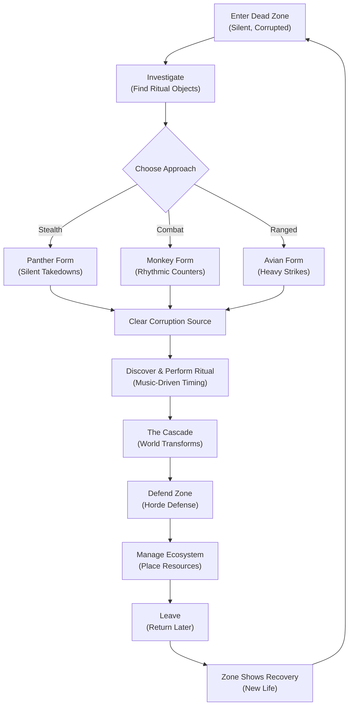
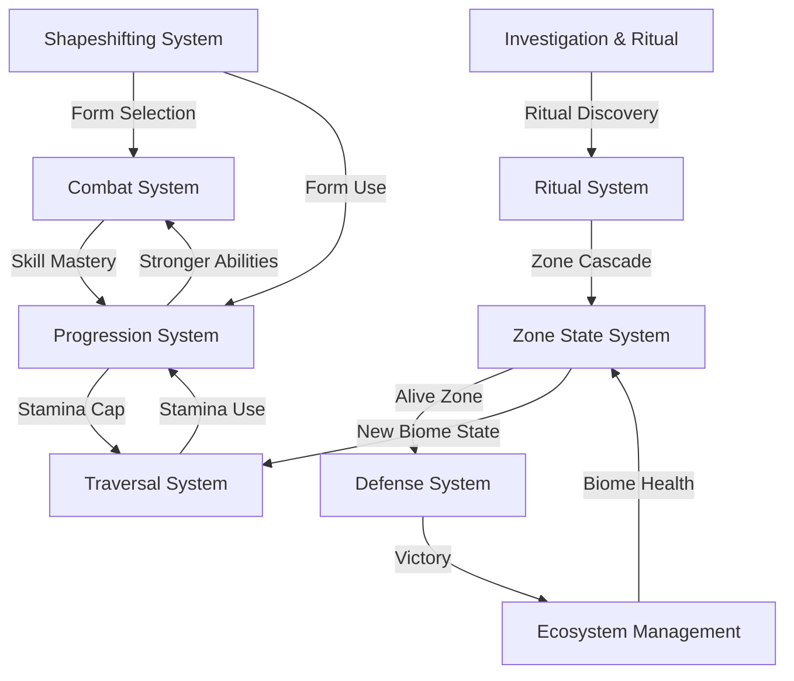
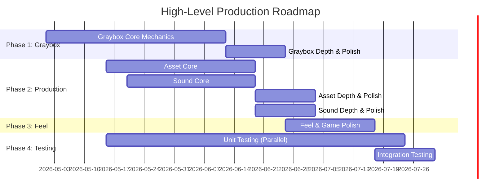

# Druid: Shape-Shifter's Ritual

## 1. The Hook & Vision

A dying world is waking up, but something is wrong.

The land is silent. The sky hangs grey. Where there should be birdsong and wind, there's only the faint hum of a purple, creeping wrongness—an eldritch corruption spreading across the biomes like a parasite. You are a druid, shape-shifter of ancient magic. You have learned the old ways: to become the predator, the guardian, the archer. To call down rain and command the elements. To heal.

Your mission is to walk into these corrupted zones, one by one, and perform the rituals that will restore them. But each ritual is a discovery, not a script—you must investigate what caused the corruption, gather the ritual objects, and clear the source. Then comes the moment of transformation: the rain falls, the wind picks up, life rushes in. Colors return. The world breathes again.

But restoration is not the end—it is only the beginning of responsibility. As each zone wakes, you must defend it from a counter-attack of corruption, then spend your elemental power to shape the reborn ecosystem toward balance. When you've done enough, you leave. And when you return, the land remembers what you've done—new life has taken root. But darker questions emerge: why do some zones show signs of re-corruption? What is the true source of this purple blight?

This is a game about transformation—personal, ecological, world-scale. Every mechanic (stealth, combat, magic, resource management) flows from a single principle: **you are using the same toolkit to fight, to heal, and to build**. There are no side-quests; restoration *is* the quest.

---

### Visual Reference Mood Board

## 2. Reference Analysis

### Reference Games

We are looking at these games because they each excel at a core pillar we are building:

- **The Legend of Zelda: Breath of the Wild** — Why: Instant-input responsiveness, physical traversal (climb, swim, glide, land with impact), stamina as effort, and world-state communicated visually and by audio, not by UI text.

- **Assassin's Creed** — Why: Fluid stealth movement, magnetic cover-snapping, and the predatory flow state of infiltration.

- **Shadow of War** — Why: Magnetic targeting, crowd-control rhythm, readable counter windows, and hitpause feedback that celebrates player timing.

- **The Legend of Zelda: Skyward Sword / Skyrim** — Why: Bow mechanics with tension (heavy draw), use-to-improve progression (skills evolve through practice, not XP grinding).

- **Shadow of the Colossus** — Why: Grounded, realistic proportions and scale; feeling small against massive encounters.
- **Terra Nil** — Why: Ecosystem management as a core loop—nudging biomes toward self-sufficiency, watching them flourish, returning to find biological evidence of healing.

### The "Keep" List (What we are emulating)

- **Instant input response with slight momentum** — player movement feels immediate, like the world is listening (BotW).
- **Stamina gates exploration** — effort is visible and measurable; climbing costs stamina, swimming costs stamina, sprinting costs stamina. The world resists, but is ultimately explorable (BotW).
- **Magnetic stealth and takedowns** — stealth is a flow state, not a puzzle; smooth cover-to-cover movement (AC).
- **Rhythmic combat with readable counter windows** — combat is about reading the beat and hitting the moment (SoW).
- **Form-based progression, not weapons** — the player's identity shifts (Panther, Monkey, Avian); the form changes how you approach a challenge.
- **Use-to-improve** — throw a fireball 50 times, it gets stronger; parry 100 times, your timing window opens wider (Skyrim).
- **Minimal, contextual UI** — the screen stays clean; the world tells the story (BotW).
- **Ecosystem management as a core loop** — after restoring a zone, you shape it; returning finds life has taken root (Terra Nil).

### The "Discard" List (What we are avoiding)

- **NPC dialogue trees and quest markers** — no quest log; investigation and discovery are embedded in exploration (unlike modern open-world conventions).
- **Generic weapons and inventory bloat** — forms and magic replace weapons entirely; no "pick up 47 sword variants."
- **Crafting complexity** — ritual objects are *found*, not crafted; progression is about use and discovery, not grinding materials.
- **Continental scale** — we're building zone-by-zone, not saving a planet in one sitting. Scope is intimate and navigable.
- **Heavy story/cutscenes** — environmental storytelling and NPC behavior carry narrative; the land speaks for itself.
- **Gacha, live service, battle pass mechanics** — single-player, self-contained experience.

---

## 3. Core Identity

### Elevator Pitch

A third-person action-adventure where a shape-shifting druid learns to heal a dying world—using elemental magic, fluid stealth, and rhythmic combat against an eldritch purple corruption—and then managing the reborn ecosystem as it wakes.

### Genre & Format

- **Genre:** Action-Adventure with Exploration & Ecosystem Management
- **Format:** 3D, single-player, optional co-op ready (listen-server architecture for future)
- **Target Audience:** Players who value responsive moment-to-moment gameplay (BotW, AC), rhythmic timing (parry/counter mechanics), and emergent storytelling (environmental design over cutscenes)

### Core Pillars

1. **World State is Visual and Audio (Not UI).** The player reads zone health, corruption spread, and ecosystem recovery from what they see and hear—color gradients, particle density, ambience layering. The HUD is minimal and contextual.

2. **Responsive, Physical Movement & Combat (BotW).** Every input feels immediate. Climbing has a cadence. Landing has impact. Combat reads like rhythm—counter windows are tight, feedback is sharp, and the player feels their timing skill.

3. **One Unified Toolkit.** Forms and elemental magic are used for combat *and* restoration. Panther sneaks and sneaks past corruption. Monkey smashes enemies and clears stone debris. Avian reaches high ledges and targets distant corruption sources. There are no "side powers"—every tool has purpose.

4. **Dead-to-Alive Transformation.** The emotional peak of the game is the ritual moment and the cascade after it. A grey, silent biome becomes vibrant, alive, and unique. This permanence matters: returning to a restored zone shows biological recovery, and the zone feels *different* in play.

---

### Narrative & Lore Foundation

**The Premise:** An eldritch purple corruption has been spreading across the world, draining life and turning biomes into silent wastelands. The cause is unknown; only the symptom is visible—purple veins spreading from deep, active corruption sources.

You are a druid, an inheritor of ancient magic. You know the shape-shifting forms and the elemental rituals. Your role is not to "save the world" in a climactic moment, but to walk into each corrupted zone and *restore* it. One zone at a time. One ritual at a time.

**The Emotional Arc:**
- **Pre-ritual:** Grounded exploration and infiltration in a dead, eerie world. You are investigating and gathering power.
- **The Ritual Moment:** A music-driven ceremony where you call down rain or summon earth or command wind. The moment is ceremonial, tense, and climactic.
- **The Cascade:** Life rushes in. Colors bloom. The zone is reborn. You feel the weight of what you've done.
- **Post-Ritual:** The zone wakes, vulnerable and newborn. You defend it from re-corruption and nudge the ecosystem toward balance. This is work, not heroism.
- **The Mystery:** As you restore zones, patterns emerge. Some show signs of *re-corruption* later. Why? What is the true source? This question drives the macro narrative forward.

---

## 4. Gameplay & Experience

### Gameplay Reference Board

---

### The Core Game Loop

Each zone follows the same arc: **Enter → Investigate → Infiltrate/Fight → Restore → Defend → Manage → Leave**.

But the beauty is in the *choices* you make along the way. When you spot a hive of eldritch cultists, do you slip in as a Panther, silent and predatory, picking them off one by one? Or do you step forward as a Monkey, summoning wind-twisted strength, ready to counter their telegraphed strikes and feel the *thump* of hitpause on every perfect parry? The zone itself tells you what's possible—its layout, its corruption density, the enemy types you're facing.

Once you've cleared the corruption source, you discover the ritual. Not a script handed to you, but a recipe you've uncovered: water, earth, wind, or fire. You perform the ceremony, and the music builds. Your timing windows tighten. The moment arrives—and the cascade *fires*. Water rushes. Wind picks up. Life floods back in. The zone transforms from grey silence into vibrant, breathing biome.

But the ritual is not the ending. It's the beginning of a new phase: defense. The zone is waking, vulnerable. Corruption mounts a counter-attack, and you defend it. Then comes the quiet work—ecosystem nudging. You have elemental power to spend: place water sources, scatter seeds, call wind to push debris. Guide the zone toward self-sufficiency. When it no longer needs you, you leave. And when you return—weeks later, in-game—you find new life has taken root. Trees have grown. Animals have returned. The world remembered your work.

### Moment-to-Moment Experience

**The Feeling: Immediate, Physical, Responsive**

Every input lands instantly. You press jump, you jump—no floaty delay, no inputlag. The world listens. When you're climbing a corrupted cliff face, you feel each handhold cost stamina. When you land from a high drop, the camera dips with impact; the world flinches. This physicality is non-negotiable. Movement is how the player reads the game state—am I tired? Can I climb this next wall? Do I have enough stamina to sprint toward that objective?

**Shapeshifting: The Core Moment**

Pressing the Shapeshift button feels like *becoming*. Your druid snaps into a new form—Panther, Monkey, Avian—with an instant elemental particle burst. The form change is immediate (one frame, no animation delay), and your velocity is preserved. You're already sprinting as a Panther before the shift completes. This keeps the action flowing; shapeshifting is not a pause, it's a tactical choice made mid-motion.

**Panther Form: The Stealth Flow State**

You crouch. Your movement becomes silent, predatory. The world muffles—ambient audio dips, but enemy tells become *louder*, sharper. You can hear their breathing, their footsteps. Magnetic positioning locks you to cover; you snap between ledges and walls fluidly (like Assassin's Creed). When you're close enough, you have a takedown window—a silent, fluid kill animation. The enemy crumples soundlessly. The hive never knows you were there. Time spent as Panther feels like a heist; you're always a step ahead, always reading the room.

**Monkey Form: The Rhythmic Clash**

You stand tall. Your fists glow with elemental power. When enemies attack, their *tells* are readable—a slight wind-up, a color flash, a sound cue. You have a counter window (tight, but learnable). Press the button at the right moment, and *hitpause*—the world freezes for a brief, satisfying moment. Then you explode forward with a heavy strike. The enemy staggers. You've turned their momentum against them. Rinse, repeat. The pacing is rhythmic, like a drum pattern. Miss a counter, and you take damage—timing matters.

**Avian Form: The Tense Precision**

You draw back a bow (or summon a ranged elemental strike). The draw is heavy, deliberate—you feel the tension building. Your camera shifts to an over-the-shoulder perspective, locked on your target. The air is quiet, focused. When you release, the arrow/strike snaps forward with *impact*. If you've lined it up right, the payoff is satisfying. If not, you've announced yourself, and the hive swarms. Avian form is about commitment—you pick a shot, you take it, and you live with the consequences.

**Traversal: Stamina as Narrative**

Stamina is not a number on a bar; it's a message. You're sprinting toward a puzzle's solution—your breath is heavy, your movement slows as the meter depletes. You can climb a tall structure, but halfway up, your arms tire. Do you rest and fall, or push and scramble for a ledge? Swimming feels like drowning if your stamina is low. Every physical action has a cost, and that cost *feels* real. This is how the player learns the world's rules: effort is visible.

**The Ritual Moment: Music-Driven Climax**

When you perform the ritual, time shifts. A pre-authored song begins. You see timing windows displayed—beats on a lane, windows to hit them. The music builds. The tension mounts. You nail the timing windows, and the music swells. The release moment: a distinct *bloom* of power radiates outward from your ritual site. Particles explode. The audio layers in fast: water → wind → rustling leaves → distant birdsong. The zone is *alive*. The player feels the weight of what they've done.

**Post-Ritual: Quiet Management**

The cascade fades. Now comes the defense phase—enemies surge toward the newly waking zone. You have to hold the line. But it's not endless; it's a *wave*. Survive it, and you move into the final phase: ecosystem nudging.

Here, time slows. You have elemental power (accrued during the ritual or earned through play). You spend it: place a water source here, scatter seeds there, summon wind to push debris away. You're *shaping* the biome. There's no combat; it's strategic and meditative. When the zone feels balanced, you know it. The bio-meter rises. You've done enough. You can leave.

---

### Journey Through a Zone (A Play Session)

1. **You enter the zone.** It's silent. Grey. The only sound is the faint hum of corruption. Your ears adjust to the emptiness—the absence of birdsong is itself a message.

2. **You investigate.** You read the land. There's a collapsed bridge here, a hive of insects there, ritual objects scattered in dangerous places. You piece together what happened. You discover the ritual recipe (water, earth, wind, or fire—or a combination).

3. **You approach the hive.** You pause. Panther or Monkey? The hive is tight, on high ground, enemies clustered. You choose Panther. You spend 20 minutes infiltrating, silent and patient. You take out three enemies without raising an alarm. The fourth spots you, and you commit—shift to Monkey, and meet the remaining hive in open combat. You trade blows, read counters, nail the timing. Hitpause. Victory.

4. **You clear the corruption source.** It's a boss—a twisted amalgamation of eldritch matter. The fight is tense, dangerous. You use all three forms: Panther to escape its grab, Monkey to parry its charge, Avian to break its weakpoint from range. When it falls, the purple aura recedes slightly.

5. **You perform the ritual.** You stand in the cleared space. Music begins. You hit the timing windows. Your fingers find the rhythm. The music crescendos. The bloom fires. Water flows. Wind rushes. Life returns.

6. **The zone defends itself.** A wave of corruption monsters surges to undo your work. You stand in their way, fighting. You're tired, but you fight. When the wave breaks, you're still standing.

7. **You manage the ecosystem.** Now it's quiet again. You have 30 minutes (or however long you choose) to nudge the zone toward balance. Water source here. Seeds there. Wind to clear that ravine. Each placement feels meaningful.

8. **You leave.** You're satisfied. The zone is alive. You know it will heal more, that life will take root. You'll come back and find signs of recovery.

9. **You return, weeks later.** There are trees now. Animals. Water runs clear. The zone is *different*—not just restored, but individualized by the choices you made. And in the deepest part, you notice something: a faint purple stain in the earth. Re-corruption is creeping back. The mystery deepens.

---

### Combat Feel: Per-Form Feedback

**Panther:** Silent. Footsteps muffled. Enemy audio heightened. Takedown animations are fluid, no sound. You're a ghost.

**Monkey:** Loud. Impact. Hitpause on counters is *extreme*—a noticeable freeze that celebrates your timing. The hit that follows is weighty. Satisfying.

**Avian:** Tension. Draw feedback (audio and visual). The release has recoil. The impact is sharp and precise.

---

---

## 5. Systems & Interactions

### Systems Reference Board

---

All the gameplay we've described flows from eight interconnected systems. Each system is independent but feeds into the others, creating emergent gameplay where your choices ripple outward.

### Core Systems

#### The Shapeshifting System
**What it is:** The druid's ability to instantly swap between three forms—Panther, Monkey, Avian—each with distinct movesets, playstyles, and feels.

**How it works:**
- Pressing the Shapeshift button snaps you into a new form in a single frame
- Your momentum is preserved (no pause, no animation delay)
- Each form unlocks different actions: Panther gets takedowns, Monkey gets counters, Avian gets draw-and-release aim
- Elemental particle burst on shift reinforces the *feel* of transformation

**Player choices:**
- Which form do I use for this encounter? (Stealth vs. direct combat vs. ranged)
- When do I shift mid-combat to adapt to new threats?
- How much time do I spend mastering each form vs. spreading my practice?

#### The Combat System
**What it is:** How the player engages with enemies—different per form, with distinct rhythms and feedback.

**Panther (Stealth):**
- Magnetic takedowns: get close enough, and you have a silent-kill window
- Focus: infiltration and predatory positioning
- Feedback: muffled audio, heightened enemy tells, silent animations
- Risk/Reward: High reward for perfect execution, but discovery = combat shift

**Monkey (Melee):**
- Counter-based rhythm: read enemy telegraphs, hit the counter window
- Magnetic targeting: enemies lock within range; you can't miss directionally
- Feedback: Extreme hitpause on successful counters (celebration of timing), weighty impacts
- Risk/Reward: High skill ceiling; perfect parries feel amazing, misses cost health

**Avian (Ranged):**
- Heavy draw-and-release: tension builds as you charge, release has recoil
- Shoulder-camera framing: focus, precision, deliberation
- Feedback: Sharp impact, satisfying arrow/strike contact
- Risk/Reward: Commits you to a shot; discovery telegraphs your position

**Player choices:**
- Which form's rhythm matches my playstyle?
- Do I engage or disengage? Is stealth available, or do I have to fight?
- How do I read enemy telegraphs and respond in the tight counter window?

#### The Traversal & Movement System
**What it is:** How the druid moves through the world—climb, swim, sprint, glide.

**Core feel:**
- Instant input response (no input lag)
- Slight momentum on direction changes (not floaty, not snappy—grounded)
- Stamina gates every major action: climbing, swimming, sprinting all cost stamina
- Landing has weight: camera dips on high falls, impact audio plays

**Stamina as narrative:**
- Stamina is not a number; it's a message. Low stamina = you're tired, movement slows, you can't climb
- Climbing a tall cliff? Halfway up, your arms tire. Do you rest and risk falling, or push and scramble?
- Swimming with low stamina? You feel like you're drowning. Every second costs dearly.

**Player choices:**
- Do I sprint toward the objective, or conserve stamina for climbing?
- Can I reach that high ledge before stamina depletes, or do I find another route?
- Which form's movement best solves this traversal puzzle? (Avian can glide, Panther can parkour, Monkey can climb)

#### The Progression System (Use-to-Improve)
**What it is:** Skills evolve through use, not through grinding XP or buying upgrades.

**How it works:**
- Throw fireballs repeatedly → fire spells deal more damage, unlock new fire variants
- Perform parries → your counter window widens, your timing becomes more forgiving
- Use a form in combat → that form's abilities scale, your mastery deepens
- No skill trees, no arbitrary leveling; every action is practice

**Feedback:**
- Players feel the improvement immediately: damage numbers rise, windows open wider, cooldowns shrink
- No grinding; mastery emerges naturally through play

**Player choices:**
- Which skills do I prioritize? (Heavy investment in one form vs. balanced across all three)
- How do I leverage my current skill level against harder zones?
- Do I stay safe with my high-mastery Panther, or branch into Monkey to handle tougher combat?

**Progression curve:**
- Early game: skills improve rapidly; every parry noticeably widens your window
- Mid-game: improvements slow; mastery becomes about consistency, not raw number gains
- Late game: Skills plateau; further gains are marginal; player mastery is the limiter, not character power

#### The Ritual & Restoration System
**What it is:** How zones transition from dead to alive—the emotional anchor of the game.

**Discovery phase:**
- Investigation *is* gameplay. Finding ritual objects scattered in the zone teaches you its story
- The ritual recipe emerges from what you've discovered: "This zone needs water to restore"
- No quest log tells you what to do; the environment is your guide

**The Ritual moment:**
- Music begins; a rhythm-based timing minigame unfolds
- You see visual lanes with beat windows
- Hit the windows, and the music swells; miss, and the cascade falters
- Success triggers the bloom—power radiates outward

**The Cascade:**
- Instant visual transformation: water flows, wind rushes, particles explode
- Audio layers in rapidly: water → wind → rustling leaves → birdsong
- The zone is alive. Not just visually restored, but *alive* with presence

**Player choices:**
- How carefully do I investigate before attempting the ritual? (Speedrun vs. thorough)
- Can I nail the timing windows? (Rhythm skill determines success)
- Which ritual type matches this zone's corruption? (Water, Earth, Wind, Fire)

#### The Zone State System
**What it is:** Every zone follows a state machine: Dead → Restoring/Defending → Alive, with visual and functional consequences.

**Dead Zone:**
- Silent, grey, cold
- Far from corruption source: grey desert, cracked earth, strong wind, no water
- Mid-range: contaminated water, darkened soil, directional wind
- Near source: active purple matter, glowing eldritch wrongness
- Enemy density: high; everything is corrupted

**Restoring/Defending:**
- Ritual complete; zone begins to wake
- Colors start returning; audio layers begin
- Player enters Defense phase: waves of corruption monsters counter-attack
- If player survives, zone transitions to Alive

**Alive:**
- Full color restoration; biome unique to your choices
- Audio fully layered: wind, water, birdsong, ecosystem activity
- Enemy density: low or zero; zone is healing
- Returns reveal biological recovery: animals, food sources, new plants

**Player choices:**
- Do I restore this zone, or move to the next? (No mandatory order)
- How much time do I spend managing the ecosystem vs. moving on?
- Which zones do I revisit to check on recovery?

#### The Defense System
**What it is:** The post-ritual gauntlet—a timed wave defense phase.

**How it works:**
- After the Cascade, the zone is vulnerable
- Corruption surges back in waves (3-5 waves, not infinite)
- Player must defend the ritual site or key biome areas
- Waves scale to zone difficulty, not player level

**Player choices:**
- Which form do I use to hold the line? (Monkey for crowd control, Panther for hit-and-run, Avian for range pressure)
- Do I bunker down in one spot, or roam to intercept waves?
- How aggressive do I play? (Risk high damage for kills, or play defensively?)

**Exit condition:**
- Survive all waves → Defense complete → unlock Ecosystem Management
- Fail a wave → retry or reset zone (mild consequence, not harsh)

#### The Ecosystem Management System
**What it is:** Post-defense, the player sculpts the biome toward self-sufficiency.

**How it works:**
- Player has elemental resources (accrued during the ritual or earned from defense)
- Place water sources, scatter seeds, summon wind to clear debris, place fire-heated stones
- Each placement affects biome health meter
- When biome reaches self-sufficiency, player can leave

**Player choices:**
- Where do I place resources for maximum impact?
- Do I optimize for speed (get the biome to self-sufficiency ASAP), or for beauty/uniqueness?
- What does a "balanced" ecosystem look like to me?

**Feedback:**
- Biome health meter rises as you place resources
- Visual changes reflect your choices: more water = more vegetation, cleared areas = room for growth
- No wrong choices, but some placements feel more elegant than others

---

### System Interconnectivity

These systems do not exist in isolation. They amplify each other:

**Example flow:**
1. Player explores Dead Zone (Traversal System)
2. Finds ritual objects and discovers ritual recipe (Investigation)
3. Attempts ritual with tight timing (Ritual System)
4. Success triggers Cascade; zone enters Restoring state (Zone State System)
5. Defense wave arrives; player uses Monkey form for crowd control (Combat + Shapeshifting)
6. Successfully defends → Ecosystem Management unlocked (Defense System)
7. Player places resources to balance biome (Ecosystem Management)
8. Biome reaches self-sufficiency; zone is now Alive (Zone State System)
9. Player leaves; zone begins healing over time
10. When player returns weeks later, zone shows biological recovery (Zone State memory)
11. Player notices faint re-corruption → new mystery zone appears → cycle repeats

---

---

## 6. Aesthetics & World

### Visual Style

The game uses **low-poly 3D with realistic, grounded proportions**—think Shadow of the Colossus' scale and humanity, not cartoonish or stylized. The druid is anatomically believable, the enemies are unsettling but readable, the world feels *real* even as it's magically corrupted.

**Richness through atmosphere, not geometry.** Lean geometry means every corner of the screen can run at 60+ FPS on target hardware. Richness comes from:
- **Particles:** Water cascades, wind trails, elemental bursts, corruption wisps
- **Lighting:** Dynamic sun/moon cycle, zone-specific mood lighting, ritual bloom effects
- **Atmosphere:** Distance haze that fades into fog, air shimmer on hot zones, mist on water

**Readability is paramount.** Strong silhouettes mean the player always knows what they're looking at—enemy types, interactive objects, corruption sources, safe zones. Minimal HUD keeps the screen clean; the world *is* the UI.

### Color Language (Locked)

The color palette tells the zone's story without words:

- **Purple / Cold Blue:** Eldritch corruption—wrongness, decay, danger. This color *feels* sick.
- **Grey / Cracked Earth:** Death and depletion—lifeless, exhausted, empty.
- **Transitional Green / Murky Water:** Partial restoration—life returning, but still fragile and recovering.
- **Soft Greens + Clear Blues + Warm Haze:** Fully restored—alive, abundant, safe, warm.

As the player performs a ritual, these colors *shift*. A grey, purple zone bleeds into green and blue. This visual transformation is the reward.

### Elemental Spirits (Read at a Glance)

Each element has a visual signature so recognizable that players know it instantly:

- **Water:** Flowing blue-white, ripple particles, droplet trails. Feels fluid and responsive.
- **Earth:** Amber/brown, dust and stone fragments, heavy settling particles. Feels grounded and solid.
- **Wind:** Green-teal, flowing trails, spiral patterns. Feels ethereal and fast.
- **Fire:** Red-orange, ember sparks, heat shimmer distortion. Feels hot and urgent.

### Main Character & Lore

The druid is the only constant across all zones. They are a **shape-shifter—physically adaptable, spiritually ancient, visually grounded.** Their forms (Panther, Monkey, Avian) are not costumes; they are *shapes the druid takes*, each with its own silhouette and readability.

**The Setting:** A world fractured by eldritch corruption. Three ages of history:
- **Before Corruption:** A lush, diverse biome with established ecosystems and civilizations (hinted through environmental storytelling—ruins, ancient artifacts, overgrown structures).
- **The Blight:** An undefined time when purple corruption spread. Society collapsed. Nature withered. The cause is unknown, but its symptoms are everywhere.
- **The Restoration:** The druid's journey. One zone at a time, bringing life back. Each restored zone becomes a beacon, a hopeful contrast to the dead zones beyond.

**Factions & NPCs:** 
- The world is **primarily environmental**—the land, the creatures, the corruption itself tell the story.
- Minor NPC presence (environmental storytellers, not quest-givers). Players read intent through behavior and position, not dialogue.
- The corruption has spawned twisted creatures (mutated insects, cultists, eldritch amalgamations)—these are obstacles, not characters.

**World Mystery:**
- Why does the corruption exist?
- Why do restored zones sometimes show signs of re-corruption?
- What is the deeper source?

This mystery unfolds through environmental discovery, not exposition.

### UI & Interface

**Production Target:** BotW-minimal. Contextual and translucent. The screen stays clean.

- **Diegetic Design:** When possible, UI elements are in-world (stamina shown through character breathing/fatigue, form shown through character appearance, health shown through character animation).
- **Minimal HUD:** Only essential info (stamina wheel, zone state indicator, current form indicator) appears on-screen.
- **Menus:** Simple, elegant, nature-themed aesthetics. Reflect the world's color language.
- **Ritual UI:** During the ritual moment, a timing lane appears with beat windows—clean, readable, not cluttered.

### Sonic Identity

**Music Philosophy:** Copy BotW's approach—music is reactive, not intrusive. It *responds* to the player's actions and the world's state.

**Every input has audio confirmation:**
- Jump: light, responsive tone
- Attack hit: satisfying impact
- Successful parry: celebratory chime + hitpause
- Form shift: elemental whoosh + harmonic shift
- Walking in silence zone: your footsteps echo unnaturally loud (emphasizing the silence)

**Ambience Communicates Zone Health:**

The dead zone is **silent**—only the hum of corruption, your footsteps, your breath. This silence is information. It tells the player: *This place is wrong. Life is gone.*

As you restore a zone, ambience **layers in:**
1. Water flows and trickles
2. Wind picks up and moves through vegetation
3. Leaves rustle, grass moves
4. Animals call: birds, insects, distant fauna
5. By fully restored zones: full ecosystem soundscape—a symphony of life

**Ritual Music (Zone/Element Specific):**

Each ritual plays a unique track tied to the element and biome:

| Element / Biome | Audio Character | Feeling |
|---|---|---|
| Water / Lake | Flowing tones, resonant bowls, rain rhythm | Cleansing, renewal, flow |
| Earth / Mountain | Deep drums, stone percussion, low resonance | Grounding, strength, stability |
| Wind / Plains | High strings, breath instruments, open tones | Freedom, ascension, clarity |
| Fire / Volcanic | Crackling pulse, primal drums, heat shimmer tones | Energy, transformation, danger |

**Sound Design Principles:**

- **Crunchy, bass-heavy impacts:** Combat feedback feels weighty (especially Monkey counters)
- **Ethereal, layered ambience:** Restored zones feel alive and organic
- **Stealth audio filtering:** When Panther-stealthed, enemy sounds heighten while ambient audio muffles—auditory tunnel vision
- **Environmental reactivity:** Open plains have different audio character than ruins vs. corruption caves

### Game Feel Direction

**Input Response:**
- Every press is immediate. The world listens instantly.
- Shapeshifting: instant snap with a quick elemental particle burst (Panther = dark purple burst, Monkey = orange/red, Avian = blue-white).
- No animation delays between player input and character action.

**Feedback Systems:**
- **Screen shake:** Sparse and deliberate; only on major impacts (boss hits, successful ritual, cascade bloom). Never on normal attacks—keeps the screen stable.
- **Hitpause:** Brief freeze on significant impacts to celebrate timing. **Extreme** for Monkey counters (this is the reward for reading the enemy).
- **Flash effects:** Clean and readable—enemy blink on hit, form glow on shift, zone bloom on ritual completion.
- **Audio as feedback:** Dead zone audio is dead—quiet, empty. Restored zones layer audio continuously; the soundscape itself signals success.

---

---

## 7. Knowledge Gaps & Research

Below are the known unknowns—design decisions and technical implementations we need to research, prototype, or validate before committing to the full architecture phase.

### Technical Unknowns

#### Shapeshift Collision Validation
**Unknown:** When the druid shifts forms, collision shapes change instantly (Panther is lithe, Monkey is bulky, Avian is lean). If the new form overlaps terrain or obstacles, the druid can clip through walls.

**Research Task:** Prototype a ShapeCast/Raycast validation system in Godot that checks if the new form fits in the current space. If not, revert the shift or nudge the player to safety.

**Why it matters:** Smooth form-switching is core to the design. Clipping breaks immersion and can soft-lock players in geometry.

#### Defense Phase Pathfinding
**Unknown:** Post-ritual, enemies spawn and pathfind toward the ritual site. With many dynamic props (player-placed ecosystem objects) and varied terrain, navigation mesh can cause enemies to get stuck or path inefficiently.

**Research Task:** Test Godot's NavigationServer with dynamic obstacle avoidance. Decide: Do we use full navmesh generation, simplified movement, or async pathfinding? Prototype enemy wave behavior with 5-10 simultaneous enemies.

**Why it matters:** Defense phase difficulty depends on enemy responsiveness. Stuck enemies = broken challenge.

#### Music-Driven Ritual Timing Mechanic
**Unknown:** The ritual is a rhythm game—player sees timing windows tied to music beats. How do we sync Godot's audio with visual UI cues? What's the latency tolerance?

**Research Task:** Build a minimal GUT test project with Godot AudioStreamPlayer and beat detection. Test hit detection windows (±100ms? ±50ms?). Validate that player can reliably hit the timing windows at 60 FPS.

**Why it matters:** The ritual moment is the emotional peak. Timing windows must feel fair and responsive, not laggy.

#### Magnetic Targeting/Lock-On System (Monkey Form)
**Unknown:** Monkey form uses "magnetic targeting"—enemies within range automatically lock in. How do we implement smooth camera focus on a moving target while keeping the player in control?

**Research Task:** Prototype a lock-on system using Godot's Camera3D. Test: Does targeting feel responsive? Can the player break lock by moving too far away? Does it work with multiple enemies in range?

**Why it matters:** Monkey's rhythm depends on clear enemy targeting. Bad targeting = broken parry windows.

#### Stealth Detection & Line-of-Sight (Panther Form)
**Unknown:** Panther stealth requires line-of-sight checks. Enemies have vision cones, hearing ranges. How do we balance stealth difficulty so the player feels sneaky, not powerless?

**Research Task:** Implement basic LOS checks using Godot's RayCast3D. Test detection ranges and angles. Validate that players can consistently navigate through enemy patrols without being seen.

**Why it matters:** Stealth flow state is core to Panther. Broken detection = frustration.

#### Zone State Cascade Effects (Visual + Audio Layering)
**Unknown:** When a ritual succeeds, the zone transforms: colors shift, particles explode, audio layers in. How do we coordinate all these systems to feel cohesive and impactful?

**Research Task:** Build a cascade prototype with: (1) color LUT transition, (2) particle system burst, (3) audio stem layering. Test that the effect feels smooth, not janky, and performs well on target hardware.

**Why it matters:** The cascade is the emotional payoff. It must feel amazing.

#### Persistent World State & Save System
**Unknown:** The game needs to save zone states (dead/restoring/alive), player progression (skills, collected items), and ecosystem data (placed resources). How do we structure this save data in JSON and load it reliably?

**Research Task:** Design a save schema. Build a minimal serialization test: Can we save a zone's state and reload it exactly?

**Why it matters:** Player should see biological recovery on revisit. Broken save = lost progression.

### Design & Math Unknowns

#### Counter Window Timing (Monkey Form)
**Unknown:** Parry windows are tight—how tight? 100ms? 50ms? Too tight and players feel cheated; too loose and combat feels mushy.

**Research Task:** Test Skyrim-style blocking windows and Shadow of War's parry frames. Target: A window that feels challenging but fair—player skill matters, but execution isn't frame-perfect.

**Why it matters:** Counter feedback is the core of Monkey rhythm. Wrong timing = broken combat feel.

#### Stamina Depletion Rates
**Unknown:** How much stamina does a sprint cost per second? A climb? A swim? How fast does stamina regenerate? These numbers define traversal pacing.

**Research Task:** Playtest and measure. Target: Player can sprint for ~3-4 seconds, climb for ~5-6 seconds. Regeneration should feel "earned"—you can't spam sprint.

**Why it matters:** Stamina gates exploration freedom. Bad numbers = frustration or too-easy traversal.

#### Form Ability Cooldown/Cost Balancing
**Unknown:** Each form has unique abilities (Panther takedown, Monkey counter, Avian draw). Should they have cooldowns? Resource costs? How do we balance usage across all three?

**Research Task:** Define cost/cooldown for each ability. Playtest: Does one form feel overpowered? Do players switch forms, or stick with one?

**Why it matters:** Form variety is core. Imbalance = less emergent gameplay.

#### Use-to-Improve Progression Curves
**Unknown:** Skills improve through use. How fast? Linearly? Exponentially? With diminishing returns? Should mastery ever cap?

**Research Task:** Design progression curves for 3-5 key skills. Playtest: Does a novice player feel improvement quickly enough? Do veterans feel a skill ceiling?

**Why it matters:** Progression is invisible (no UI), so it must *feel* right through immediate feedback.

#### Defense Wave Difficulty Scaling
**Unknown:** How many enemies per wave? How fast do they spawn? Do waves scale with player skill? With zone difficulty?

**Research Task:** Playtest defense phases with 3, 5, 10 simultaneous enemies. Target: Waves feel challenging but winnable. Player skill (parrying, dodging) directly impacts survival.

**Why it matters:** Defense phase is gating ecosystem management. If it's too hard, players can't progress. If too easy, it's boring.

#### Ecosystem Management Resource Economics
**Unknown:** Player has elemental resources to spend on ecosystem placement. How many resources? How much does each placement cost? Should resources be infinite, limited per zone, or regenerating?

**Research Task:** Design a resource budget. Playtest: Does the player feel agency in placement? Or is the "right answer" too obvious?

**Why it matters:** Ecosystem phase is a puzzle. Bad economics = either trivial or unsolvable.

### Art & Audio Pipeline Unknowns

#### Low-Poly 3D Silhouette Readability
**Unknown:** Low-poly geometry with strong silhouettes—does it work at distance? Can players clearly identify enemy types from far away?

**Research Task:** Create 3-5 enemy silhouettes in low-poly. Test at various distances and angles. Validate: Player can ID enemy type without UI labels.

**Why it matters:** Combat readability is critical. Unclear enemies = timing mistakes and frustration.

#### Particle Effect Budget & Performance
**Unknown:** Particles drive visual richness (elemental bursts, zone cascades, corruption wisps). How many particles can we spawn simultaneously before performance drops?

**Research Task:** Create a particle budget test. Spawn cascading particles and measure FPS. Target: Maintain 60 FPS at peak particle count (ritual moment, cascade effect).

**Why it matters:** The cascade is the emotional peak. Dropping to 30 FPS ruins the moment.

#### Audio Bus Routing for Stealth Filtering
**Unknown:** In Panther stealth, enemy audio heightens while ambient audio muffles. Can Godot's AudioBus system achieve this efficiently?

**Research Task:** Set up AudioBus routing with two buses (World, Enemies). Test real-time bus parameter changes during stealth transitions.

**Why it matters:** Stealth audio feedback is how the player knows they're "in the zone."

#### Ritual Music Composition & Adaptation
**Unknown:** Four element types × four biome types = potentially 16 unique ritual tracks. How do we compose/source music that feels cohesive while being distinct?

**Research Task:** Identify or commission 4 ritual tracks (one per element). Validate that each feels unique but part of the same sonic world.

**Why it matters:** Ritual moments are memorable. Music makes or breaks them.

#### Animation Transitions Between Forms
**Unknown:** Shifting from Panther to Monkey mid-animation (e.g., during a takedown or parry) needs to look smooth. Can Godot's AnimationPlayer blend between form rigs?

**Research Task:** Create two skeletal meshes (Panther, Monkey) and test animation blending on shift. Target: No visible pop or jank on transition.

**Why it matters:** Form-shifting is a core mechanic. Janky transitions feel cheap.

---

---

## 8. Technical Frame & Roadmap

### Technical Architecture

**Engine & Platform:**
- **Engine:** Godot 4.6+ (GDScript)
- **Target Platform:** PC (Windows, macOS, Linux)
- **Unit Scale:** 1 unit = 1 meter
- **Rendering:** Forward+ with optional GI for production phase
- **Physics:** Jolt (default in Godot 4.6)

**Core Systems:**
- **PlayerRoot:** `CharacterBody3D` handles physics, gravity, stamina, input
- **FormManager:** Swaps form child branches (mesh, collision, animation) in one frame; preserves velocity on shift
- **SkillTracker (Autoload):** Dictionary-based use-to-improve progression with signals for skill evolution
- **ObjectPool:** Pre-allocates enemy and particle instances to avoid runtime instantiation stutter
- **DefenseManager:** Wave director and enemy spawner for post-ritual horde defense
- **CascadeManager:** Ecosystem resource placement and biome health tracking

**Data & Persistence:**
- **Save Format:** Single JSON save file at `user://save_data.json` (portable across machines)
- **Save Contents:** World state (zone conditions, placed resources), player progression (skills, collected items), session history
- **Input System:** Godot InputMap with semantic actions (Jump, Attack, Shapeshift, Interact, etc.)
- **Audio Routing:** Strict AudioBus separation (World vs Enemies) for stealth-mode audio filtering

**Multiplayer Foundation (Future):**
- Architecture ready for listen-server co-op expansion
- Input gathering separated from simulation logic (non-authority peers driven by replicated state)
- Currently: Single-player only

### Key Technical Risks & Mitigation

**Risk 1: Shapeshift Collision Clipping**
- **Problem:** Form-shifting changes collision shapes instantly. New form may overlap terrain.
- **Mitigation:** Implement ShapeCast/Raycast validation before form swap. If new form doesn't fit, either revert the shift or nudge player to nearby safe space.
- **Prototype:** Simple test in early graybox phase to validate approach.

**Risk 2: Defense Phase Enemy Pathfinding**
- **Problem:** Many simultaneous enemies with dynamic obstacles (player-placed ecosystem objects) can cause stuck agents and navigation failures.
- **Mitigation:** Use Godot's NavigationServer with dynamic obstacle avoidance. If performance degrades, fallback to simplified movement or async pathfinding. Test early with 5-10 enemies.
- **Prototype:** Pathfinding stress test in mid-graybox phase.

**Risk 3: Music Sync & Ritual Timing Latency**
- **Problem:** Ritual mechanic is rhythm-based; timing windows must sync precisely with audio. Network latency (if co-op added later) could break timing fairness.
- **Mitigation:** Use Godot AudioStreamPlayer with local beat detection. Validate hit detection windows (target: ±50-100ms tolerance). For co-op, implement client-side prediction and server clock sync.
- **Prototype:** Rhythm test in graybox—validate latency tolerance at 60 FPS.

### Production Roadmap

The game ships in **four production phases:**

#### Phase 1: Graybox Prototype (Mechanics & Code)
**Duration:** 6-8 weeks
**Goal:** Playable core loop with placeholder visuals, no sound. Prove all mechanics work.

**Core (Mandatory):**
- Player movement system (BotW-style traversal with stamina)
- Shapeshifting core (instant form swap, collision validation)
- Panther form (stealth, takedowns, detection)
- Monkey form (parry/counter, magnetic targeting, hitpause)
- Avian form (ranged, aim camera, impact feedback)
- Use-to-improve progression backend
- Zone state machine (dead → restoring → alive)
- Defense phase manager (wave director)
- Biome management system (resource placement, health tracking)
- Enemy AI (basic cultist behavior, pathfinding)
- Rain ritual mechanic (music timing, cascade system)
- Minimal HUD (stamina, form indicator, zone state)

**Depth (Secondary):**
- Lock-on targeting system
- Investigation system (finding ritual objects)
- Zone re-corruption triggers
- Biological recovery simulation over time

**Polish (Nice-to-Have):**
- Input buffering
- Perfect parry slowmo effect

#### Phase 2: Production Art & Audio (5-6 weeks, parallel with Phase 1 code refinement)

**Asset Phase (Visual Art):**
- Player druid model (low-poly, readable silhouette)
- Shapeshifted forms (Panther, Monkey, Avian)
- Base character animations (movement, attacks, form shifts)
- Dead zone terrain tileset
- Eldritch corruption terrain and visual language
- Enemy models (cultists, corrupted creatures)
- Ritual site models and environmental dressing
- Depth: Restored zone terrain, placeable ecosystem props, enemy variants
- Polish: UI art refinement, zone transition screens

**Sound Phase (Audio):**
- Stealth acoustic filter and bus mixing setup
- Combat hit SFX and impact feedback
- Dead zone ambient soundscape
- Ritual music (4 zone types × 4 elements = potential 16 unique tracks; core: 4 base tracks)
- Cascade activation audio (water, wind, rustling, birdsong)
- Depth: Shapeshifting SFX, restored zone ambience, enemy vocalizations
- Polish: Environmental audio variation, animal ambient sounds

#### Phase 3: Feel & Polish (3-4 weeks)

**Game Feel Direction:**
- Shapeshifting snap VFX (elemental particle bursts)
- Combat hitpause tuning (hit detection windows, feedback timing)
- Eldritch shatter VFX (corruption effects)
- Cascade release bloom (ritual payoff visual)
- Attack flashes for counter readability
- Depth: Stealth vignette effect, elemental particle signatures, particle density reflecting biome health
- Polish: Player damage flash, landing impact effects, screen shake tuning

#### Phase 4: Testing & Optimization (Ongoing parallel)

**Unit Testing:**
- Test scaffold (GUT framework setup)
- Per-mechanic test coverage (movement, combat, progression, ritual)

**Integration & Load Testing:**
- Full zone playthrough stress tests
- Defense wave performance (10+ enemies simultaneously)
- Particle effect budget validation (maintain 60 FPS at cascade peak)
- Audio bus switching under load

### Production Timeline (High-Level)

### Scope & MVP Definition

**The MVP (Minimum Viable Product) is the graybox prototype—one complete zone with all core mechanics working:**
- Full zone loop: explore → investigate → stealth/combat → ritual → defense → ecosystem management
- All three forms functional with distinct feels
- Zone state transitions with visual/audio feedback
- Use-to-improve progression tracking
- Defense wave with 5-10 enemies
- Ritual timing mechanic with at least one zone music track

**Post-MVP (Production phase) adds:**
- High-fidelity art assets replacing placeholder geometry
- Full sound design and music
- Multiple zone biome types
- Game feel polish (VFX, hitpause tuning, screen shake, etc.)
- Depth features (lock-on, investigations, re-corruption, recovery simulation)

### Technical Debt & Future Proofing

**Planned from Day 1:**
- Input/simulation separation for future co-op
- AudioBus architecture for dynamic mixing
- Resource pooling to avoid instantiation stutter
- Save system that scales to multiple zones/biomes

**Deferred (Post-MVP):**
- Co-op networking (listen-server architecture designed but not implemented)
- Procedural terrain generation (currently hand-authored zones)
- Advanced AI behaviors (cultist group tactics, fleeing, morale)
- Difficulty scaling (currently single difficulty)

---

---

## Summary

**Druid: Shape-Shifter's Ritual** is a single-player action-adventure where responsive gameplay, rhythmic combat, and ecosystem stewardship merge into one experience. It asks: *What does it mean to heal a world, not save it?* The answer is in every mechanic—stealth infiltration, melee rhythm, ranged precision, magic restoration, and ecosystem balance. Every tool you have is dual-use. Every zone you restore is unique. And the world remembers.
